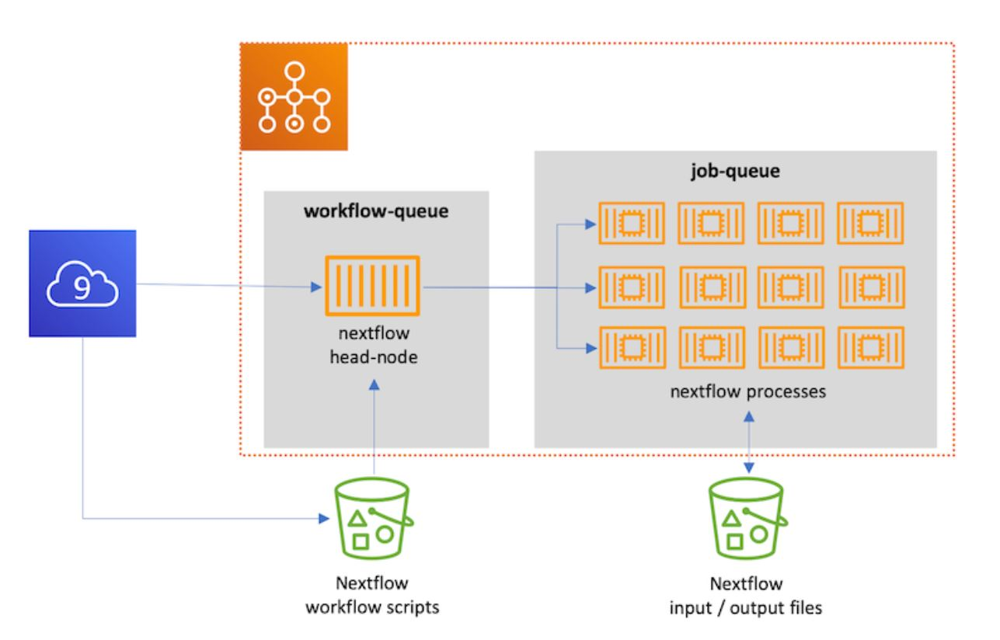

# Create Batch Job Queue
{: .no_toc }

## Table of contents
{: .no_toc .text-delta }

1. TOC
{:toc}

---

## Detach Nextflow Run

To decouple the supervision we are going to start the process within a second AWS Batch queue, so that it will stick around as long as the execution takes. Some call this scenario AWS Batch Squared because it uses a queue to submit to a queue.

[Previous Step](https://juychen.github.io/docs/Setup){: .btn }
[Next Step](https://juychen.github.io/docs/Setup/Cloud9IAM.html){: .btn .btn-purple }

