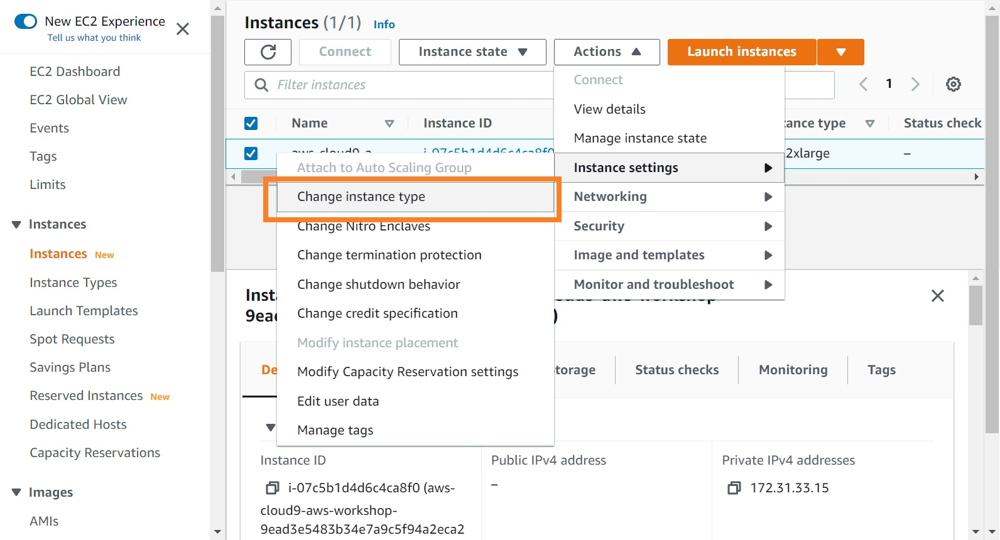

# Change EC2 types
{: .no_toc }

## Table of contents
{: .no_toc .text-delta }

1. TOC
{:toc}

---

## Change the number of CPU and Memory for the Cloud9 

In this step, we will increase the amount of CPU and memory storage in Cloud9. To performe this modification, we need to stop the instances by selecting: "Instance state -> Stop Instance". It may take serveral second for the system to stop the instance.

Afterwards, we will change the instance type of the Cloud9 workspace. To performe this modification, select: "Actions -> Change instances type". In the pop-up menu, we can select the instance type of "t3a.2xlarge". This instance type will have 32GB of memory and 8 CPUs to meet the minimun requirement of runing the workshop.

Finially, we need to restart the Cloud9 Environment at: [https://console.aws.amazon.com/cloud9/home](https://console.aws.amazon.com/cloud9/home).

