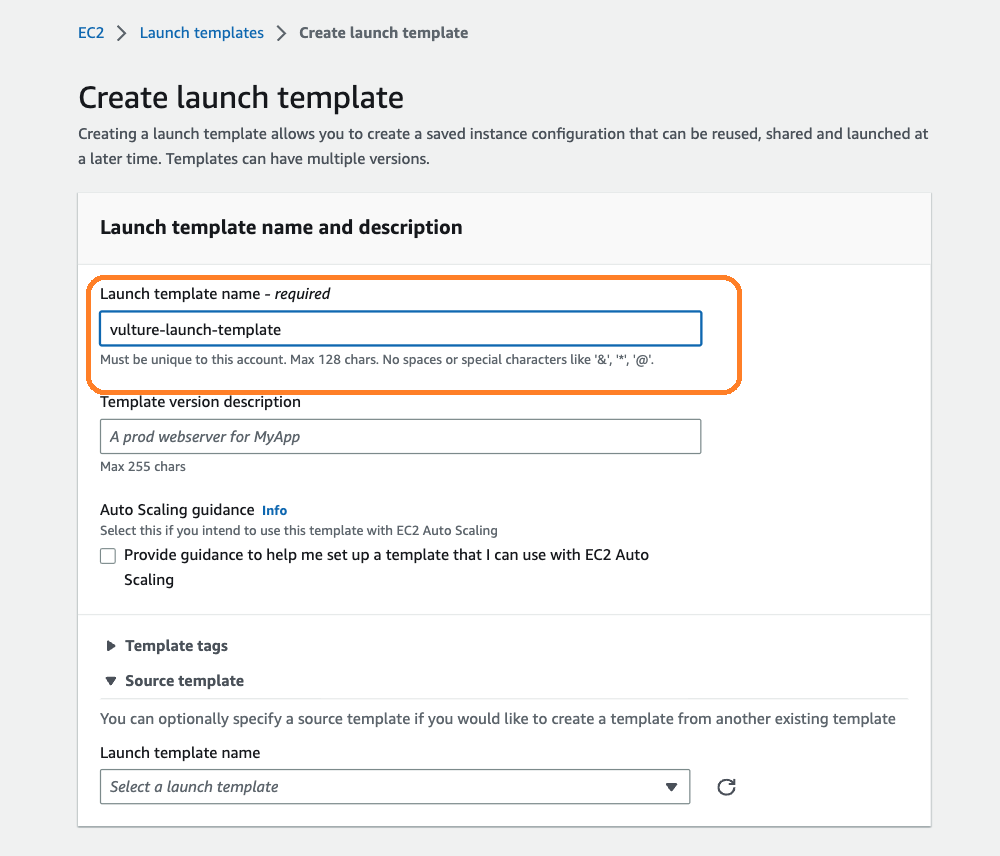

# Create AWS Batch Environmnet
{: .no_toc }

## Table of contents
{: .no_toc .text-delta }

1. TOC
{:toc}

---

## Setup Launch Template

Before we start, we need to setup a launch template of EC2 instance for our computing environments for AWS batch. Because we have mentioned in the previous section that the storage of EC2 instance is not enough for the scRNA-Seq data preprocessing.

The launch template can be created in either GUI-way or through AWS Command Line (AWS CLI).

To create the template in GUI-way, navigate to AWS EC2 dashboard at [AWS EC2 Home](https://console.aws.amazon.com/batch/home). In the left panel menu, select "Launch Templates" under Instances.





Alternatively, you can run the following command to create the launch template from CLI. 

The launch template file in our project (launch-template-data.json) is shown as follows:
```json
{
    "LaunchTemplateName": "increase-volume",
    "LaunchTemplateData": {
        "BlockDeviceMappings": [
            {
                "DeviceName": "/dev/xvda",
                "Ebs": {
                    "VolumeSize": 2500,
                    "VolumeType": "gp2"
                }
            }
        ]
    }
}
```
With this template name "vulture-launch-template", we can increase the default storage of EC2 instances to 2500GB. We can run the following script: 

Run the command below to create this template.
```shell
aws ec2 --region ${AWS_REGION} create-launch-template --cli-input-json launch-template-data.json

```
