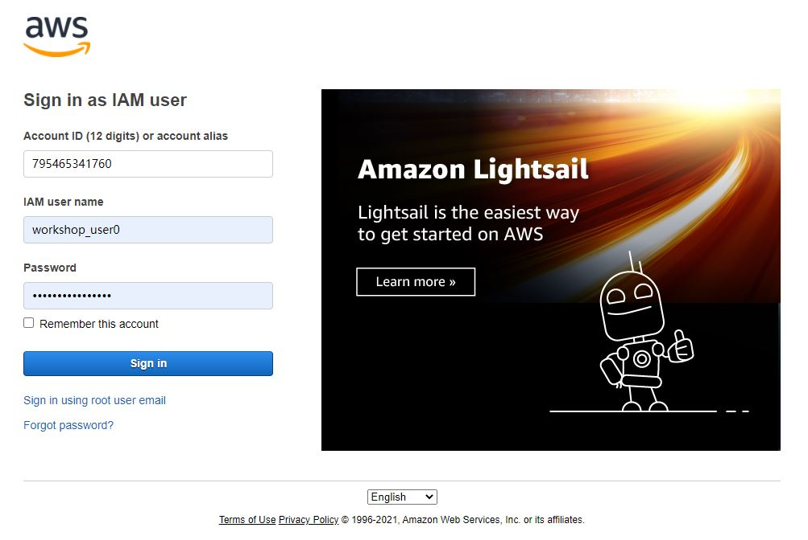

# AWS account
We will create several testing accounts during the workshop.
You can go to the website to login:
[https://795465341760.signin.aws.amazon.com/console](https://795465341760.signin.aws.amazon.com/console)

## Import rules of using the AWS account
The account you get have high level of permissions sinces they are neccessary to run the whole pipeline. I would like to express my gratitude for you if you can be careful to keep the data in our account save and sound. 

I hope all you can remind the following rules: 
- Make sure all services you play are within the Ohio (us-esat-2) region.
- Do not terminate any instances or delete any services if you are not confident
- Do not go to the IAM page to infere other accounts
- Contact to the admin if you have problem creating and editing any services.

Thank you very much and hope you enjoy the workshop.

[Previous Step](https://juychen.github.io/docs/1_Introduction/Introduction.html){: .btn }
[Next Step](https://juychen.github.io/docs/2_Setup/Setup.html){: .btn .btn-purple }

