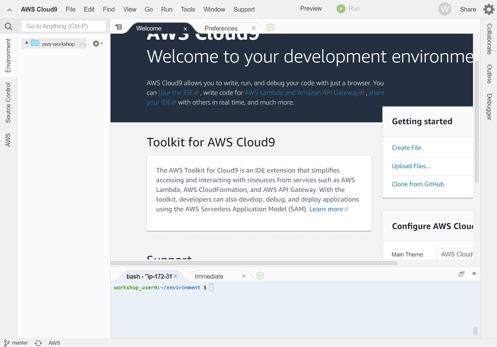

# Cloud9
{: .no_toc }

## Table of contents
{: .no_toc .text-delta }

1. TOC
{:toc}

---

## Launch Cloud9

Create a Cloud9 Environment at: [https://console.aws.amazon.com/cloud9/home](https://console.aws.amazon.com/cloud9/home).

- Select Create an environment
- Name it "aws-workshop-userxxx" which "userxx" is your user name to better identification of your instance
- Select the instance type of "t3.2xlarge". This instance type will have 32GB of memory and 8 CPUs to meet the minimum requirement of running the workshop.


Your workspace should now look like this:



## Increase the storage of the Cloud9 EBS

The default 10GB storage, 1 CPU, and 1GB memory of Cloud9 workspace is quite small. Thus, it is good for us to increase the computational resources used by the Cloud9 instance for the tutorial.

Firstly, we increase the storage of the instance. To increase the EBS volume, please perform as follows:
1. Select the Cloud9 instance in the [EC2 console](https://console.aws.amazon.com/ec2/v2/home#Instances).
2. Click the "Storage" chart
3. Roll down, explore, and click on the "Volume ID" in the list
4. Select the Volume in the list
5. Click "Modify volume" in the sub-menu of the "Actions" button
6. Modify the volume type and size on your own demand (e.g. 100GiB) and click modify.


## Resize File system
Changing the block device does not increase the size of the file system.
To do so head back to the Cloud9 instance terminal and use the following commands.

```shell
sudo growpart /dev/xvda 1
sudo xfs_growfs $(df -h |awk '/^\/dev/{print $1}')
df --human-readable
```

The root file system should now show 99GB.

```shell
Filesystem      Size  Used Avail Use% Mounted on
devtmpfs        483M   60K  483M   1% /dev
tmpfs           493M     0  493M   0% /dev/shm
/dev/xvda1       99G  8.0G   91G   9% /
```

Consequently, the storage of our Cloud9 workspaces is 100GB now.

## Download data from the AWS S3 bucket

After we have increased the number of storage, we can download the toy read files and the reference genome from our S3 bucket.

Amazon Simple Storage Service (Amazon S3) is an object storage service offering industry-leading scalability, data availability, security, and performance. Customers of all sizes and industries can store and protect any amount of data for virtually any use case, such as data lakes, cloud-native applications, and mobile apps. With cost-effective storage classes and easy-to-use management features, you can optimize costs, organize data, and configure fine-tuned access controls to meet specific business, organizational, and compliance requirements.

We can download neccessarry files using the following command:

```shell
aws s3 cp s3://awsscwsbucket/ref/transcripts_to_genes.txt ~/environment/aws-workshop/ref/transcripts_to_genes.txt & \
aws s3 cp s3://awsscwsbucket/ref/transcriptome.idx ~/environment/aws-workshop/ref/transcriptome.idx & \
aws s3 cp s3://awsscwsbucket/seqs/SRR11537951_toy/SRR11537951_1.fastq.gz ~/environment/aws-workshop/data/SRR11537951_1.fastq.gz &\
aws s3 cp s3://awsscwsbucket/seqs/SRR11537951_toy/SRR11537951_2.fastq.gz ~/environment/aws-workshop/data/SRR11537951_2.fastq.gz;
```

Notices that this is a toy example that we randomly sample reads (with size < 1GB) from the original fastq file. Therefore the result looks a bit strange.
You directly head to the next process and let the download in the background.

## Attach the IAM role to the Cloud9 Workspace

An IAM role is an IAM identity that you can create in your account that has specific permissions. It is an AWS identity with permission policies that determine what the identity can and cannot do in AWS. We need to grant necessary permissions to the Cloud9 environments to run the tutorial.

- Select the Cloud9 instance in the [EC2 console](https://console.aws.amazon.com/ec2/v2/home#Instances).

- Select the instance, then choose "Actions -> Security -> Modify IAM Role"


- Choose "aws-workshop-admin" from the IAM Role drop-down, and click "Save" (we created this following the [IAM role setting page](https://juychen.github.io/docs/10_Supplementary/IAMsettings.html)). 


Here, we have attached the IAM role to our Cloud9 environment.

## Managed Credential Handling from Cloud9
To not have Cloud9 overwrite the IAM roles with temporary credentials, we will disable temporary credential management within Cloud9.


<div class="code-example" markdown="1">
[Previous Step](https://juychen.github.io/docs/2_Setup/Setup.html){: .btn }
[Next Step](https://juychen.github.io/docs/2_Setup/SetupNextflow.html){: .btn .btn-purple }
</div>
