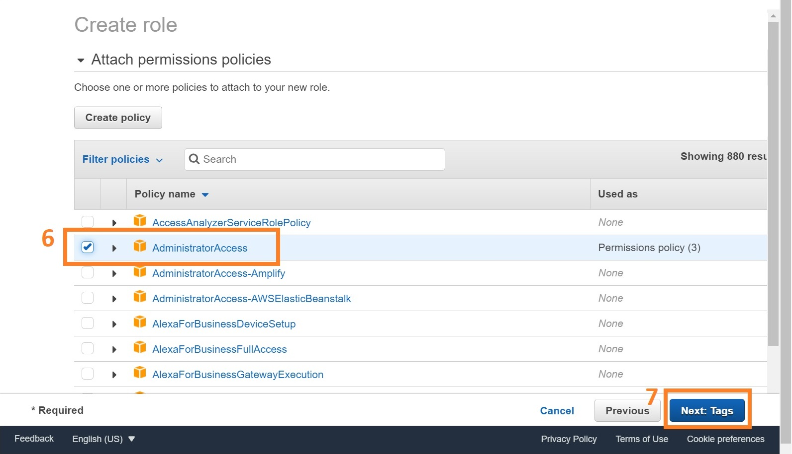
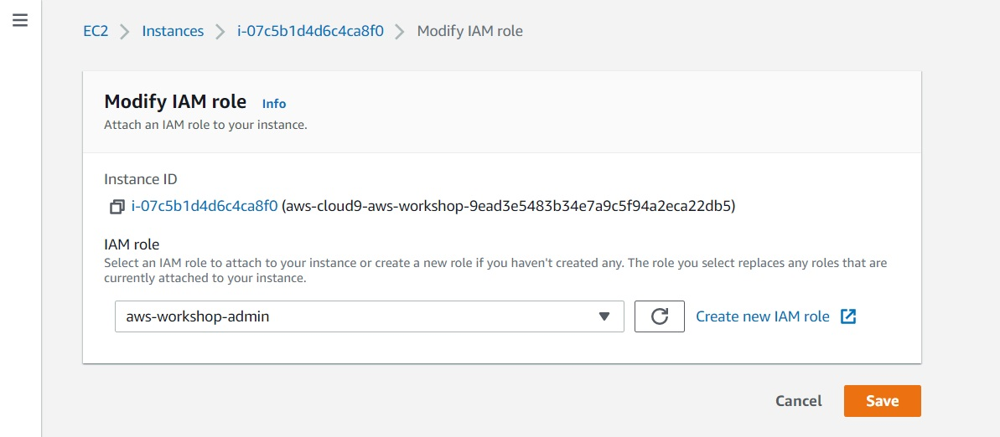

# Cloud9 IAM settings
{: .no_toc }

## Table of contents
{: .no_toc .text-delta }

1. TOC
{:toc}

---

An IAM role is an IAM identity that you can create in your account that has specific permissions. It is an AWS identity with permission policies that determine what the identity can and cannot do in AWS. We need to grant neccessary permissions to the Cloud9 environments to run the tutorial.

## Create an IAM role for your Workspace

Head over to the [IAM console](https://console.aws.amazon.com/iam/home), find and click "Create role" button **(2)** under the Roles **(1)** section.

Select the "AWS service" **(3)** and choose the "EC2" use case **(4)** hit Next button **(5)** at the bottom.

Select the policy named "AdministratorAccess" **(6)**.

Tag the role with a key named "aws-workshop" with an empty value, name the role as "aws-workshop-admin" and click "Create role".

Therefore, a role named "aws-workshop-admin" is ready for the Cloud9 envrioment.

## Attach the IAM role to the Cloud9 Workspace

- Select the Cloud9 instance in the [EC2 console](https://console.aws.amazon.com/ec2/v2/home#Instances).

- Select the instance, then choose "Actions -> Security -> Modify IAM Role"

- Choose aws-workshop-admin from the IAM Role drop down, and click "Save"

Here, we have attached the IAM role to our Cloud9 environment.

## Managed Credential Handling from Cloud9
To not have Cloud9 overwrite the IAM roles with temporary crendentials, we will disable temporary crendential management within Cloud9.

[Previous Step](https://juychen.github.io/docs/Setup/Cloud9.html){: .btn }
[Next Step](https://juychen.github.io/docs/Setup/Nextflow.html){: .btn .btn-purple }

