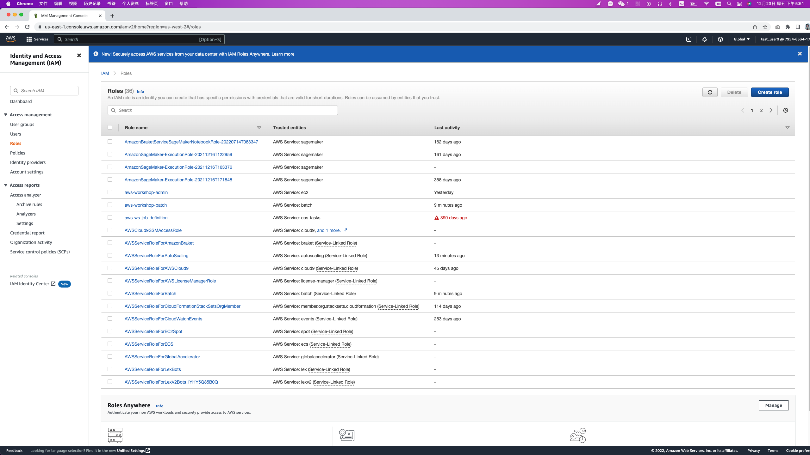
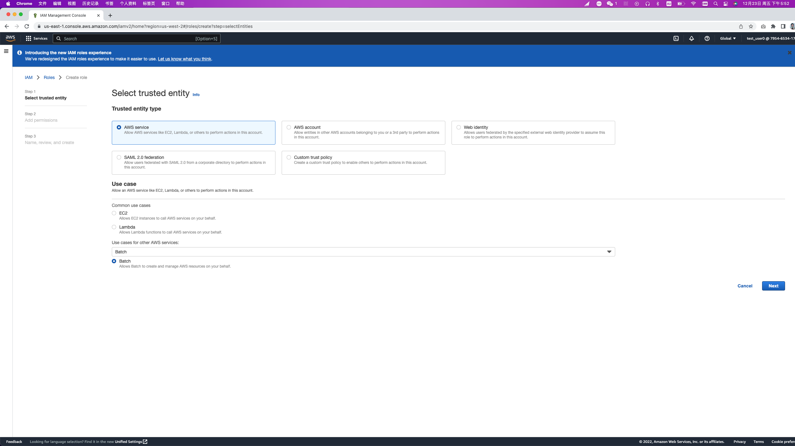
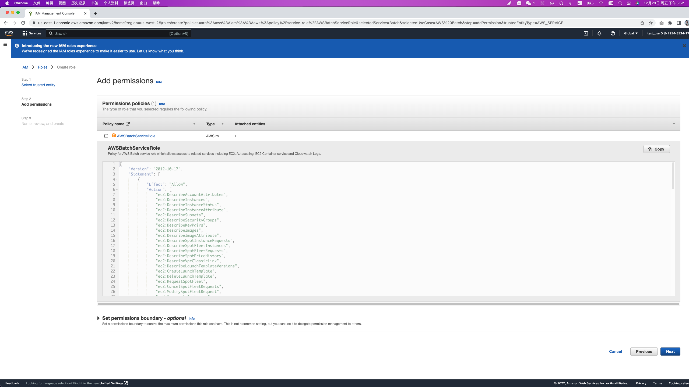
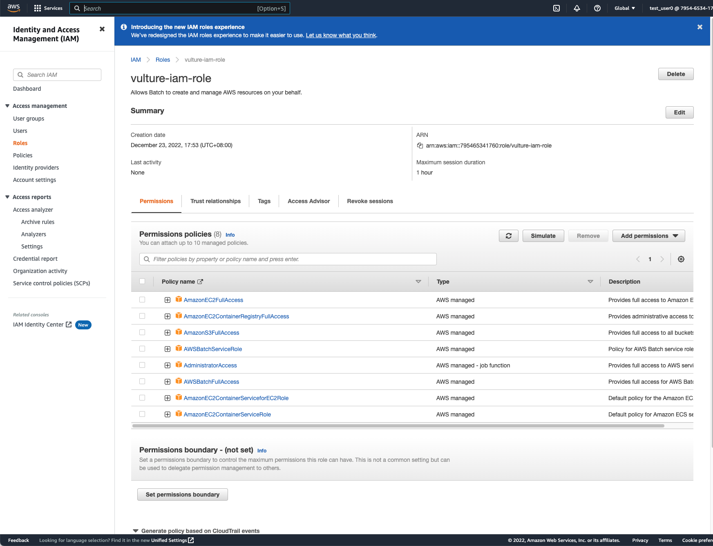
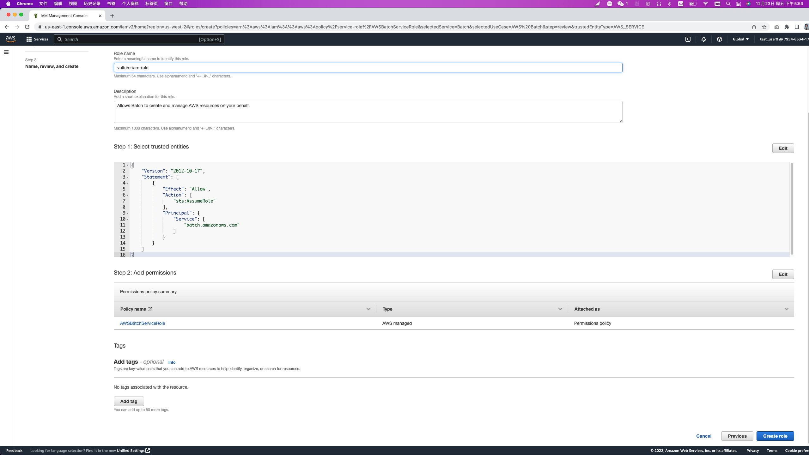

# IAM
{: .no_toc }

## Table of contents
{: .no_toc .text-delta }

1. TOC
{:toc}

---
## Create an IAM role for your Workspace

Head over to the [IAM console](https://console.aws.amazon.com/iam/home), find and click "Create role" button **(2)** under the Roles **(1)** section.

Select the "AWS service" **(3)** and choose the "Batch" use case **(4)** hit Next button **(5)** at the bottom.

Select the following policies and click "attach policies" to add them **(6)**.
- AdministratorAccess
- AmazonEC2FullAccess
- AmazonEC2ContainerRegistryFullAccess
- AmazonS3FullAccess
- AWSBatchServiceRole
- AdministratorAccess
- AWSBatchFullAccess
- AmazonEC2ContainerServiceforEC2Role
- AmazonEC2ContainerServiceRole

Name the role as "vulture-iam-role" and click "Create role".

Therefore, a role named "aws-workshop-admin" is ready for use.

[Previous Step](https://juychen.github.io/docs/2_Setup/Setup.html){: .btn }
[Next Step](https://juychen.github.io/docs/3_Nextflow/Nextflow.html){: .btn .btn-purple }

