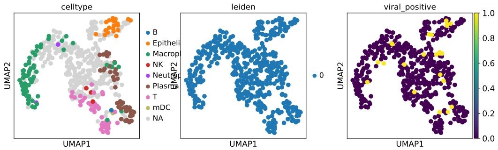

# Nextflow and scRNA-Seq processing
{: .no_toc }

## Table of contents
{: .no_toc .text-delta }

1. TOC
{:toc}

---
## Introduction 
Attached is the Nextflow script we apply in this tutorial. It is a simple script using KB to align scRNA-Seq reads to a KB indexed reference transcriptome (including transcripts_to_genes.txt and transcriptome.idx) and generate a count matrix. The Nextflow script will scan the input folder "data/" to find a pair of read files. Names of the input reads files should have the format of "(SRR run id)_1.fastq.gz" for barcode reads, and "(SRR run id)_2.fastq.gz" for cDNA reads. After the alignment is finished, we will collect the count matrix file "adata.h5ad" as input of the Scanpy based python script named "analysis.py". In the python script, we find the cells with viral UMIs, and perform simple visualization of the cells by UMAP.

You can refer to the [Nextflow documentation](https://www.nextflow.io/docs/latest/getstarted.html) for more information about Nextflow syntax and usage.

```shell
#!/usr/bin/env nextflow
/*
 * pipeline input parameters
 */
params.baseDir = "."
params.reads = "$baseDir/data/*_{2,1}.fastq.gz" 
params.outdir = "$baseDir/outputs"
params.refdir = "$baseDir/ref"
params.codebase = "~"
log.info """\
        - N F   P I P E L I N E -
         ===================================
         references   : ${params.refdir}
         reads        : ${params.reads}
         outdir       : ${params.outdir}
         """
         .stripIndent()


Channel
    .fromFilePairs( params.reads )
    .ifEmpty { error "Cannot find any reads matching: ${params.reads}" }
    .view()
    .set { read_pairs_ch }

/*
 * 1. Mapping
 */
process Map {
    input:
    tuple val(SRR_id), file(reads) from read_pairs_ch
    path ref from params.refdir
    output:
    val SRR_id into id_ch
    file("alignment_results/") into results_ch

    shell
    """
    kb count -x=10XV2 -g="${ref}/transcripts_to_genes.txt"  -i="${ref}/transcriptome.idx" -o="alignment_results" --tmp="~/kbtemp" --h5ad \
    "${params.baseDir}/${SRR_id}_1.fastq.gz" \
    "${params.baseDir}/${SRR_id}_2.fastq.gz" \
    """
}
/*
 * 2. Analysis
 */
process Analysis {
    cpus 4
    memory '8 GB'
    publishDir "${params.outdir}", mode: "copy"
    input:
    file result from results_ch
    output:
    file('alignment_results') into results2_ch
    
    shell
    """
    cp ${params.codebase}/meta.csv alignment_results/meta.csv
    cd alignment_results
    mkdir write
    python ${params.codebase}/analysis.py "counts_unfiltered/adata.h5ad"
    cd ../
    """
}
```
## Download data from the AWS S3 bucket

Before we started, we need to download the toy read files and the reference genome from our S3 bucket.

Amazon Simple Storage Service (Amazon S3) is an object storage service offering industry-leading scalability, data availability, security, and performance. Customers of all sizes and industries can store and protect any amount of data for virtually any use case, such as data lakes, cloud-native applications, and mobile apps. With cost-effective storage classes and easy-to-use management features, you can optimize costs, organize data, and configure fine-tuned access controls to meet specific business, organizational, and compliance requirements.

We can download neccessarry files using the following command:

```shell
aws s3 cp s3://awsscwsbucket/ref/transcripts_to_genes.txt ~/environment/aws-workshop/ref/transcripts_to_genes.txt & \
aws s3 cp s3://awsscwsbucket/ref/transcriptome.idx ~/environment/aws-workshop/ref/transcriptome.idx & \
aws s3 cp s3://awsscwsbucket/seqs/SRR11537951_toy/SRR11537951_1.fastq.gz ~/environment/aws-workshop/data/SRR11537951_1.fastq.gz &\
aws s3 cp s3://awsscwsbucket/seqs/SRR11537951_toy/SRR11537951_2.fastq.gz ~/environment/aws-workshop/data/SRR11537951_2.fastq.gz;
```

Notices that this is a toy example that we randomly sample reads (with size < 1GB) from the original fastq file. Therefore the result looks a bit strange.

## Redirect results to the S3 bucket

We can store the output files to the S3 to reduce the cost of maintaining EC2 instances and EBS storage. The following command will create our S3 bucket to store the result. 

``` shell
export BUCKET_NAME_RESULTS=nextflow-spot-batch-result-${RANDOM}-$(date +%s)
aws --region ${AWS_REGION} s3 mb s3://${BUCKET_NAME_RESULTS}
aws s3api put-bucket-tagging --bucket ${BUCKET_NAME_RESULTS} --tagging="TagSet=[{Key=nextflow-workshop,Value=true}]"
echo "BUCKET_NAME_RESULTS=${BUCKET_NAME_RESULTS}" |tee -a ~/.bashrc 
echo ${BUCKET_NAME_RESULTS}
```

In this step, you will create a bucket on the AWS S3. It will have a fold name like "nextflow-spot-batch-result-19074-1637920838". Remember to **Save the AWS bucket location**. This location will be the path that stores your experiment result. Also, this bucket will be used in the following step. The above command will show the result of the resulting bucket.

Here, we can run the Nextflow script.

``` shell
nextflow run script0.nf --outdir=s3://${BUCKET_NAME_RESULTS}/outputs
```

The script will take around 5 minutes to run. A successful run of the script will output something like this：

``` shell
N E X T F L O W  ~  version 21.10.3
Launching `script0.nf` [serene_euclid] - revision: 03d5e629a6
- N F   P I P E L I N E -
 ===================================
 references   : /home/ec2-user/environment/aws-workshop/ref
 reads        : /home/ec2-user/environment/aws-workshop/data/*_{2,1}.fastq.gz
 outdir       : /home/ec2-user/environment/aws-workshop/outputs

[SRR11537951, [/home/ec2-user/environment/aws-workshop/data/SRR11537951_1.fastq.gz, /home/ec2-user/environment/aws-workshop/data/SRR11537951_2.fastq.gz]]
executor >  local (2)
[01/79910a] process > Map (1)      [100%] 1 of 1 ✔
[96/da8bfe] process > Analysis (1) [100%] 1 of 1 ✔
Completed at: 26-Nov-2021 09:01:21
Duration    : 4m 49s
CPU hours   : 0.1
Succeeded   : 2
```

Then, we can list the result in the S3 bucket

``` shell
aws s3 ls ${BUCKET_NAME_RESULTS}/outputs/alignment_results/
```

The result should be somthing similar to this.
``` shell
workshop-user-00:~/environment/aws-workshop (main) $ aws s3 ls ${BUCKET_NAME_RESULTS}/outputs/alignment_results/
                           PRE counts_unfiltered/
                           PRE figures/
                           PRE write/
2021-11-26 10:06:05          0 
2021-11-26 10:06:13   12533760 10x_version2_whitelist.txt
2021-11-26 10:06:13        574 inspect.json
2021-11-26 10:06:20       2167 kb_info.json
2021-11-26 10:06:11   83672160 matrix.ec
2021-11-26 10:06:20     182785 meta.csv
2021-11-26 10:06:08  126870353 output.bus
2021-11-26 10:06:16   77054193 output.unfiltered.bus
2021-11-26 10:06:13        460 run_info.json
2021-11-26 10:06:13   18376572 transcripts.txt
2021-11-26 10:06:22       1921 viral_cells.csv
```

This result folder includes all alignment results generated by the KB count function. The folder "counts_unfiltered" stores the count matrix. JSON files are the logs of the KB count function. BUS files are the pseudo alignment result. Folder "figures" and "write" are figures and processed scanpy object generated by our python script.

You can go the [S3 bucket link here](https://s3.console.aws.amazon.com/s3/home) to retrieve your results. For example, we can have a look at the umap plot in the path: "s3://${BUCKET_NAME_RESULTS}/outputs/alignment_results/figures/umapumapplot.pdf" page. The plot should be something like this:


You can download it to your own computer via the browser or click to open it. The result UMAP plot should be similar to this: 



The umap plot is generated from a very small subset of reads from Liao et al.'s study. In the first subplot, we display cell type information derived from the metadata in the same study. Due to the different processing pipelines, there may be some cells do not present in the original study. The third subplot highligthed the virus infected cells.  The second subplot looks a little strange because the number of cells is smaller while the sequencing depth is relatively low.

<div class="code-example" markdown="1">
[Previous Step](https://juychen.github.io/docs/3_Nextflow/NextflowDocker.html){: .btn }
[Next Step](https://juychen.github.io/docs/4_Batch/Batch.html){: .btn .btn-purple }
</div>