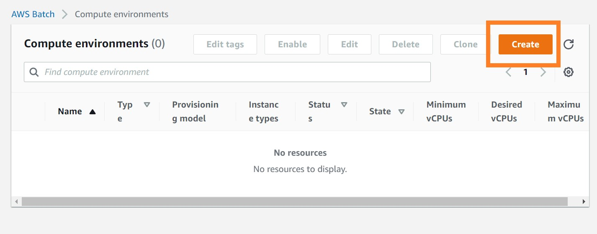
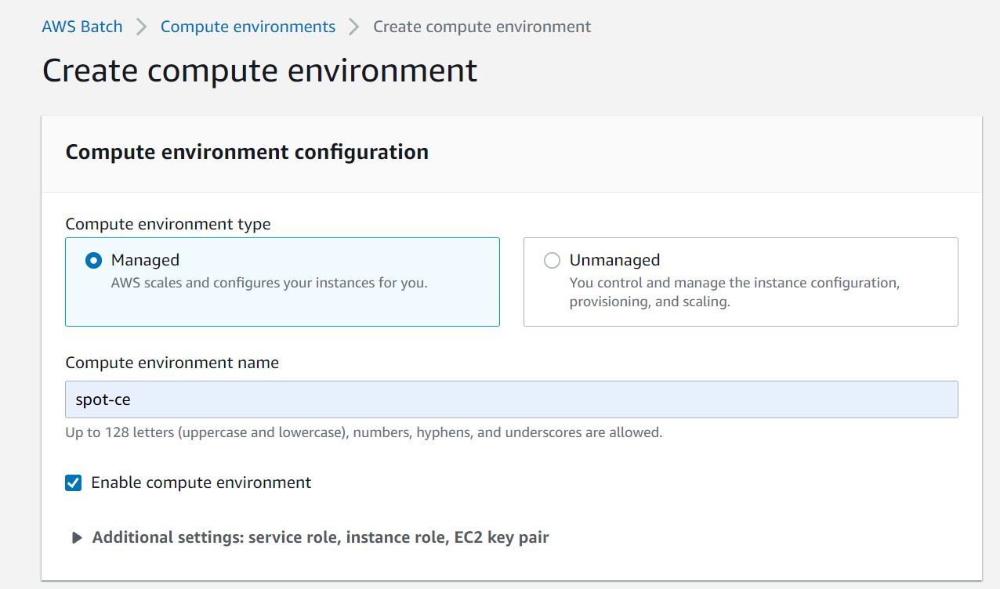
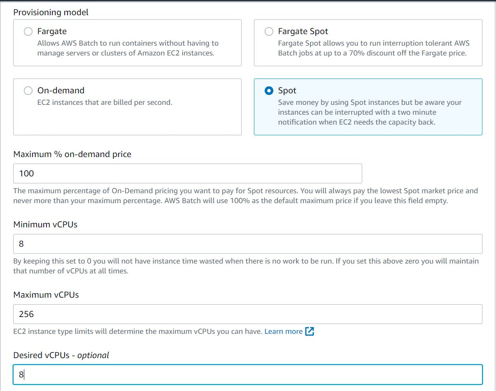
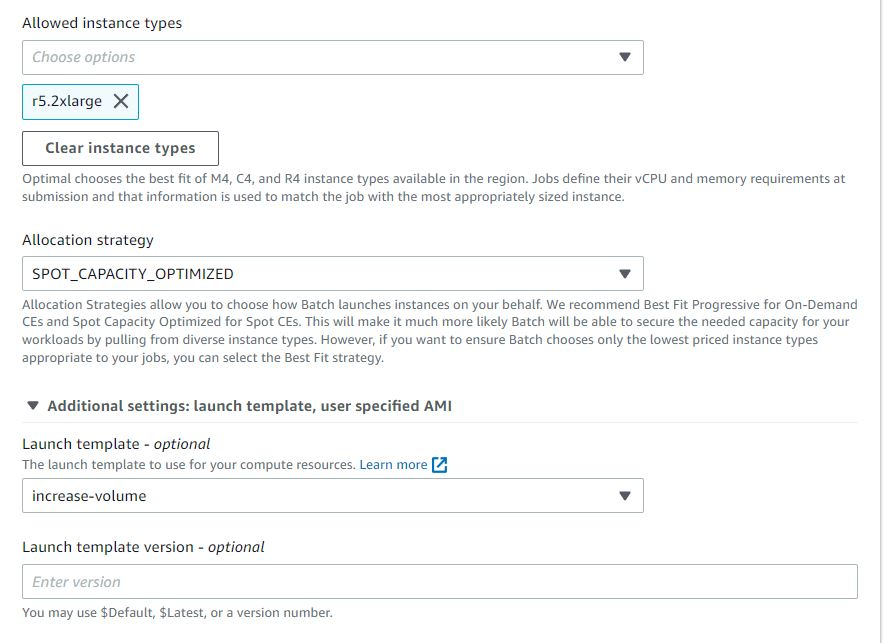

# Create Batch Compute Environmnet
{: .no_toc }

## Table of contents
{: .no_toc .text-delta }

1. TOC
{:toc}

---

## Setup Batch Vulture Compute Environment 1

Create an AWS Batch Environment at [https://console.aws.amazon.com/batch/home](https://console.aws.amazon.com/batch/home).

1. Select "Compute environments" on the left panel
2. Select "Create" to create a new compute environments

In the compute environments page, set your preference of the compute environment as follows:
3. Select "Managed" in the compute environment type
4. Change the environment name in the compute environment name. We suggest that you should use "scvh-CE-r5a4x".

5. Select "Spot" in the provisioning model in order to save money
6. Set "0" in both Minium and desired vCPU settings
7. Go back to the "Additional settings: service role, instance role, EC2 key pair" pannel below the "Managed" compute environment type.
8. Select "aws-workshop-batch" in the service role ([IAM role settings](https://juychen.github.io/docs/2_Setup/SetupIAM.html)). 
9. Select "aws-workshop-admin" in the instance role ([IAM role settings](https://juychen.github.io/docs/2_Setup/SetupIAM.html)). 

10. Select "optimal" in the Allowed instance type.
11. Select "SPOT_CAPACITY_OPTIMIZED" in the allocation strategy
12. Select "increase-volume" in the  [launch template](https://juychen.github.io/docs/10_Supplementary/Launchtemp.html). 

We apply this template because we have mentioned in the previous section that the storage of EC2 instance is not enough for the Vulture pipeline. 

Leave other settings of the environment as default and create an environment.

## Setup Batch Vulture Compute Environment 2 

This basically follows the same steps as to create Compute Environment 1 above, but with different name and instance type.

1. Select "Compute environments" on the left panel
2. Select "Create" to create a new compute environments

In the compute environments page, set your preference of the compute environment as follows:
3. Select "Managed" in the compute environment type.
4. Change the environment name in the compute environment name. We suggest that you should use "scvh-CE-3".

5. Select "Spot" in the provisioning model in order to save money
6. Set "0" in both Minium and desired vCPU settings
7. Go back to the "Additional settings: service role, instance role, EC2 key pair" pannel below the "Managed" compute environment type.
8. Select "aws-workshop-batch" in the service role ([IAM role settings](https://juychen.github.io/docs/2_Setup/SetupIAM.html)). 
9. Select "aws-workshop-admin" in the instance role ([IAM role settings](https://juychen.github.io/docs/2_Setup/SetupIAM.html)). 

10. Select "optimal" in the Allowed instance type.
11. Select "SPOT_CAPACITY_OPTIMIZED" in the allocation strategy
12. Select "increase-volume" in the  [launch template](https://juychen.github.io/docs/10_Supplementary/Launchtemp.html). 

We apply this template because we have mentioned in the previous section that the storage of EC2 instance is not enough for the Vulture pipeline. 

Leave other settings of the environment as default and create an environment.

[Previous Step](https://juychen.github.io/docs/4_Batch/Batch.html){: .btn }
[Next Step](https://juychen.github.io/docs/4_Batch/BatchQueue.html){: .btn .btn-purple }

