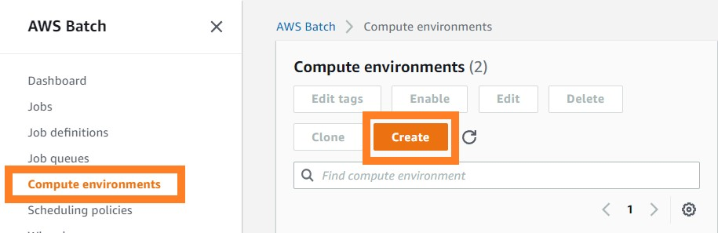
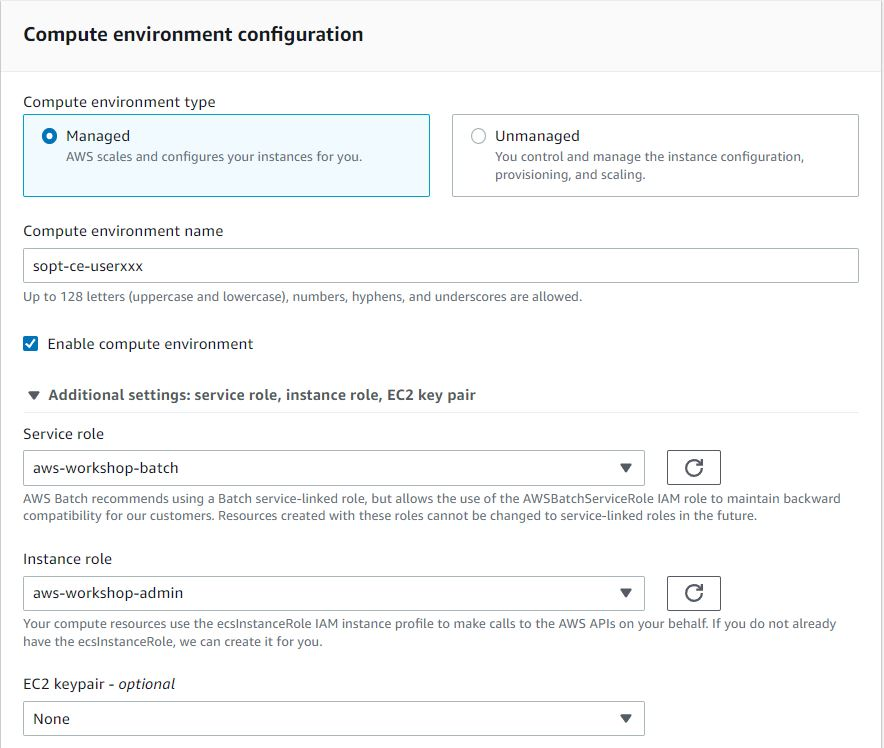
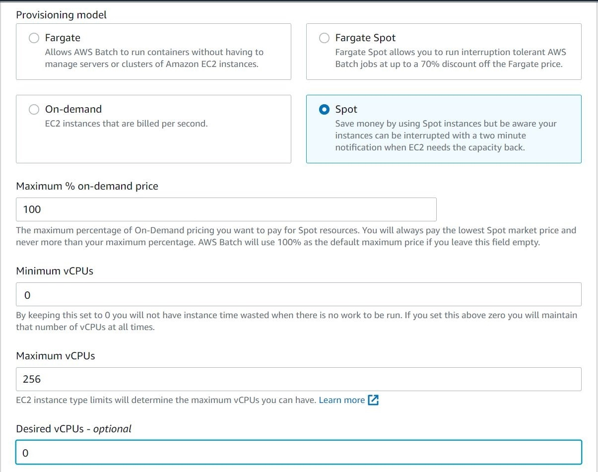

# Create Batch Compute Environmnet
{: .no_toc }

## Table of contents
{: .no_toc .text-delta }

1. TOC
{:toc}

---

## Setup Batch Compute Envirionment

Create an AWS Batch Environment at: [https://console.aws.amazon.com/batch/home](https://console.aws.amazon.com/batch/home).

- Select "Compute environments" on the left panel
- Select "Create" to creat a new compute environments

In the compute environments page, set your preference of the compute envrioment as follows:
- Select "Managed" in the compute environment type
- Change the enviromnet name in the compute envrionment name. We suggest that you should use "spot-ce-userxxx" according to your own username.
- Select "aws-workshop-batch" in the service role ([IAM role settings](https://juychen.github.io/docs/10_Supplementary/IAMsettings.html)). 
- Select "aws-workshop-admin" in the instance role ([IAM role settings](https://juychen.github.io/docs/10_Supplementary/IAMsettings.html)). 

- Select "Spot" in the provisioning model in order to save money
- Set "8" in both Minium and desired vCPU settings in order to run KB

- Select "m5.4xlarge" in the Allowed instance type because KB require at least 8 Cores and around 32GB memory.
- Select "SPOT_CAPACITY_OPTIMIZED" in the allocation strategy
- Select "increase-volume" in the  [launch template](https://juychen.github.io/docs/10_Supplementary/Launchtemp.html). 
 

Because we have mentioned in the previous section that the storage of EC2 instance is not enough for the scRNA-Seq preprocessing. 

[Previous Step](https://juychen.github.io/docs/4_Batch/Batch.html){: .btn }
[Next Step](https://juychen.github.io/docs/4_Batch/BatchQueue.html){: .btn .btn-purple }

