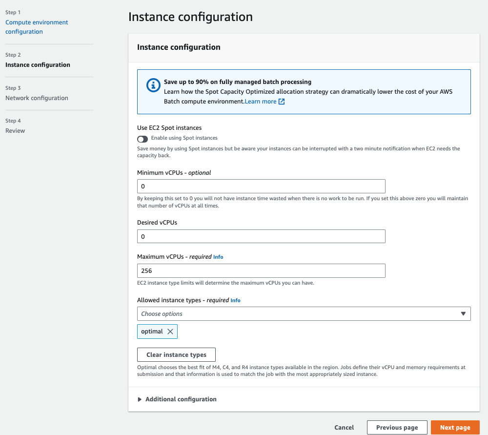
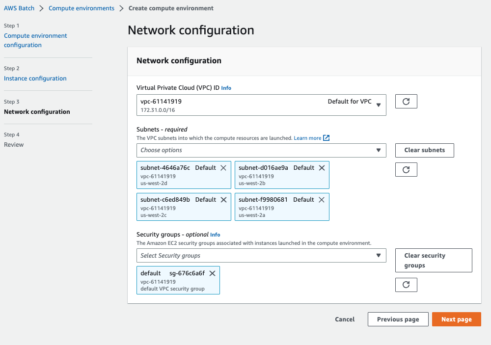

# Create Batch Compute Environmnet
{: .no_toc }

## Table of contents
{: .no_toc .text-delta }

1. TOC
{:toc}

---

## Create a launch template 
Before you create an AWS Batch Compute Environment, please kindly refer to [how to create Vulture launch template](https://juychen.github.io/docs/6_Cloud/RunVulture.html) to create a launch template first.

## Setup Batch Vulture Compute Environment 1

Create an AWS Batch Environment at [AWS Batch Home](https://console.aws.amazon.com/batch/home).

On the AWS Batch dashboard:
1. Select "Compute environments" on the left panel
2. Select "Create" to create a new compute environments

In the Compute Environments page, set your preference of the compute environment as follows:
Step 1 Compute environment configuration
3. Select "Managed" in the compute environment orchestration type
4. Change the Name in the compute environment name. We suggest that you should use "scvh-CE-r5a4x".
5. Select "vulture-iam-role" in the Service role ([IAM role settings](https://juychen.github.io/docs/2_Setup/SetupIAM.html)). 
6. Select "ecsInstanceRole" in the Instance role. 

Step 2 Instance configuration
7. Select "Use EC2 Spot Instances" for cost-saving

8. Set "0" in both Minium and Desired vCPU settings, and 256 in Maximum CPUs -required
9. Scoll down to the "Additional configuration".

10. Select "optimal" in the Allowed instance type.
11. Select "SPOT_CAPACITY_OPTIMIZED" in the allocation strategy

12. Select "vulture-launch-template" under Launch template. For how to create this template beforehand. Please refer to [launch template](https://juychen.github.io/docs/10_Supplementary/Launchtemp.html). 

We apply this template to every instance Batch schedules for us because we have mentioned in the previous section that the default  storage of EC2 instance is not enough for the Vulture pipeline, this template will provide extra spaces for our Batch job's instance. 

Step 3 Network configuration
13. Select "Default for VPC" under the Virtual Private Cloud (VPC) ID, this will select the [default VPCs](https://docs.aws.amazon.com/vpc/latest/userguide/default-vpc.html). Note that all AWS accounts comes with a default VPC for use in each Region. A default VPC comes with a public subnet in each Availability Zone, an internet gateway, and settings to enable DNS resolution. Therefore, you can immediately start launching Amazon EC2 instances into a default VPC. A default VPC is suitable for getting started quickly.

Leave other settings of the environment as default and create an environment.

## Setup Batch Vulture Compute Environment 2 

This basically follows the same steps as to create Compute Environment 1 above, but with different name and instance type, to enable massively parallel processing of Vulture tasks with Batch.

1. Select "Compute environments" on the left panel
2. Select "Create" to create a new compute environments

Repeat the configuration steps from Step 2. to Step 13 to finish create Compute Environment 2 used for creating Compute Environment 1 above.

[Previous Step](https://juychen.github.io/docs/4_Batch/Batch.html){: .btn }
[Next Step](https://juychen.github.io/docs/4_Batch/BatchQueue.html){: .btn .btn-purple }

