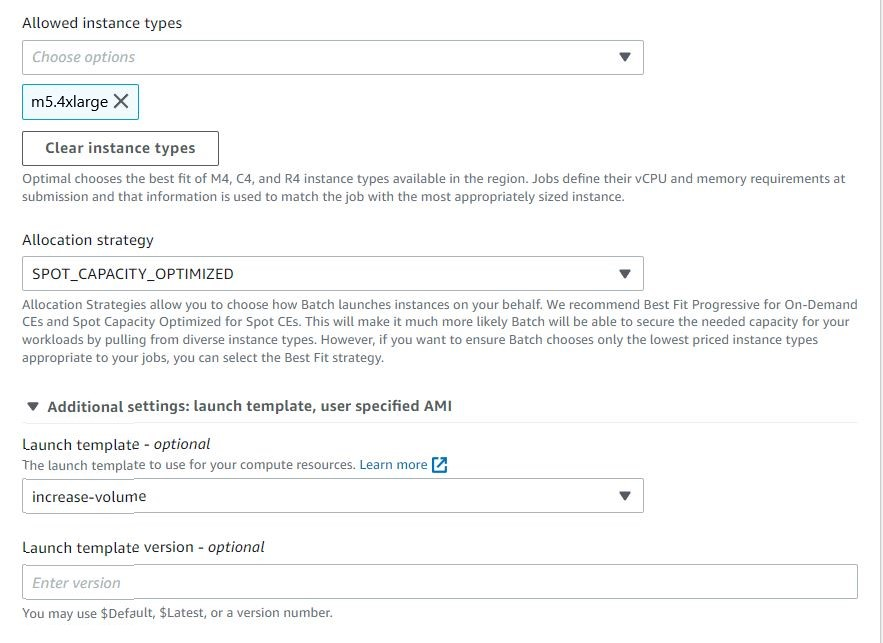

# Create A Batch Simple Batch Job
{: .no_toc }

## Table of contents
{: .no_toc .text-delta }

1. TOC
{:toc}

---

In this section, we will learn to creat Batch jobs trough the AWS Batch website. However, since it would take long to finish an KB job. We just try to test whether KB is correctally configured in our created container in the present section.

## Create a job definition
In the previous steps we created resources needed to run AWS Batch jobs. Now we can creat a job in the AWS console

Create an AWS Batch Environment at: [https://console.aws.amazon.com/batch/home#job-definition](https://console.aws.amazon.com/batch/home#job-definition). 

- Select "Job Definition" on the left panel
- Select "Create" to creat a new job definition

- Enter a name for you definition such as "touch-kb-definition-userxxx"
- Select "EC2" in the Platform type

- Insert our image url "public.ecr.aws/b6a4h2a6/kb_workshop:latest" in the 'Image' field.
- Leave the 'Command' field blank.

In the AWS Batch console, choose Job Definitions, Create.
For the Job Definition, enter a name, for example, fetch_and_run.
For IAM Role, choose the role that you created earlier, batchJobRole.
For ECR Repository URI, enter the URI where the fetch_and_run image was pushed, for example: 012345678901.dkr.ecr.us-east-1.amazonaws.com/awsbatch/fetch_and_run.
Leave the Command field blank.
For vCPUs, enter 1. For Memory, enter 500.

In the compute environments page, set your preference of the compute envrioment as follows:
- Select "Managed" in the compute environment type
- Change the enviromnet name in the compute envrionment name. We suggest that you should use "spot-ce-userxxx" according to your own username.
- Select "aws-workshop-batch" in the service role ([IAM role settings](https://juychen.github.io/docs/10_Supplementary/IAMsettings.html)). 
- Select "aws-workshop-admin" in the instance role ([IAM role settings](https://juychen.github.io/docs/10_Supplementary/IAMsettings.html)). 

- Select "Spot" in the provisioning model in order to save money
- Set "8" in both Minium and desired vCPU settings in order to run KB

- Select "m5a.4xlarge" in the Allowed instance type because KB require at least 8 Cores and around 32GB memory.
- Select "SPOT_CAPACITY_OPTIMIZED" in the allocation strategy
- Select "increase-volume" in the  [launch template](https://juychen.github.io/docs/10_Supplementary/Launchtemp.html). 
 

Because we have mentioned in the previous section that the storage of EC2 instance is not enough for the scRNA-Seq preprocessing. 

[Previous Step](https://juychen.github.io/docs/Setup){: .btn }
[Next Step](https://juychen.github.io/docs/Setup/Cloud9IAM.html){: .btn .btn-purple }

