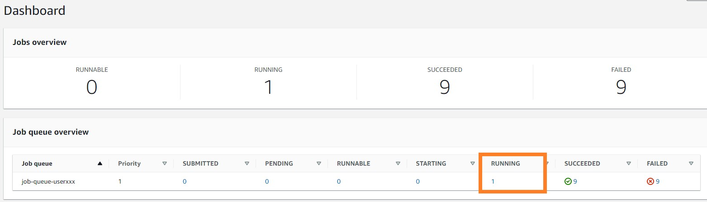
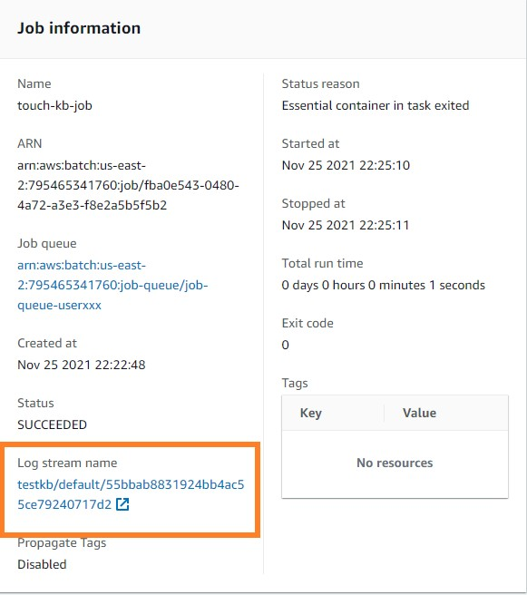

# Create A Batch Simple Batch Job
{: .no_toc }

## Table of contents
{: .no_toc .text-delta }

1. TOC
{:toc}

---

In this section, we will learn to creat Batch jobs trough the AWS Batch website. However, since it would take long to finish an KB job. We just try to test whether KB is correctally configured in our created container in the present section.

## Create a job definition
In the previous steps we created resources needed to run AWS Batch jobs. Now we can creat a job in the AWS console

Create an AWS Batch Environment at: [https://console.aws.amazon.com/batch/home#job-definition](https://console.aws.amazon.com/batch/home#job-definition). 

- Select "Job Definition" on the left panel
- Select "Create" to creat a new job definition


- Enter a name for you definition such as "touch-kb-definition-userxxx"
- Select "EC2" in the Platform type


- Insert our image url "public.ecr.aws/b6a4h2a6/kb_workshop:latest" in the 'Image' field.
- Leave the 'Command' field blank.


- Set vCpus as 1 and Memory around 512 because we juet need to check the kb status in the container.
- Select "aws-ws-job-definition" in Job and Execution role.
- Left other option as default and select "Create" 


## Submit and run a Job

- Select "Job" on the left panel
- Select "Submit new job" to creat a new job


- Name your job
- Select the job definition you created (such as touch-kb-definition-userxxxx)
- Select the job queue you created (such as job-queue-userxxxx)


- Fill the following cod to the command filed

```shell
kb -h "&>" kbout ; cat kbout
```
It is a code to call KB help documentation and show it in the standard output stream.

- Set vCpus as 1 and Memory as 500
- Leave other filed as default and submit your job


Now a simple job to call KB help funtion is submit to the job queue you creat.

## Minitoring Job

Heading back to the [dashboard](https://console.aws.amazon.com/batch/home#dashboard), you can see the overview of the number of task runing in the job queue. To monitor your runing jobs, you can click the number below the lable "RUNNING".



Here, you can find the job we submit previously. Click the job name to go to the Jb information page.


Inside the infomation page, you can click the link below the "Log stream name" label. This is where the ouput of the program store. It will record any information output within the stand ouput stream of the console. Also, the console output will refresh contiuniously along with your program process.



Inside the log stream, we can see the help information of the KB tool as we expect.


<div class="code-example" markdown="1">
[Previous Step](https://juychen.github.io/docs/Setup){: .btn }
[Next Step](https://juychen.github.io/docs/Setup/Cloud9IAM.html){: .btn .btn-purple }
</div>
