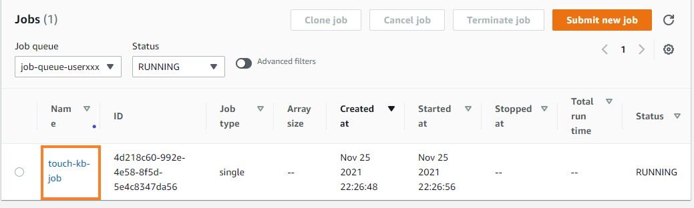
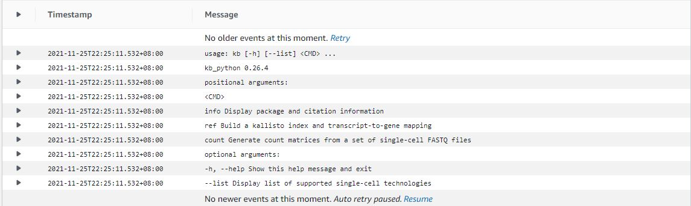
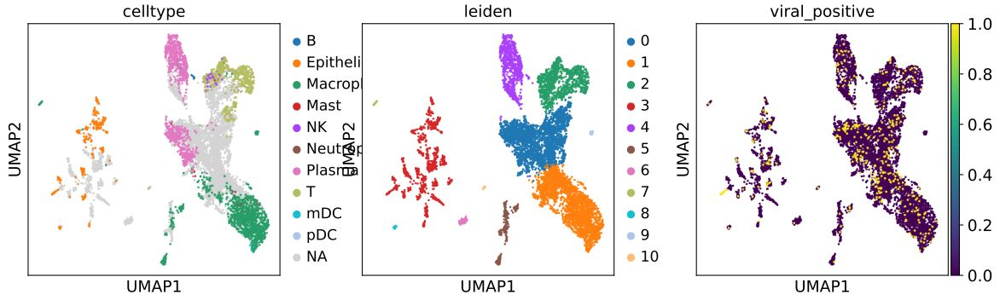

# Nextflow on Batch
{: .no_toc }

## Table of contents
{: .no_toc .text-delta }

1. TOC
{:toc}

---

## Monitoring Job

Heading back to the [dashboard](https://console.aws.amazon.com/batch/home#dashboard), you can see the overview of the number of tasks running in the job queue. To monitor your running jobs, you can click the number below the label "RUNNING".

Here, you can find the job submited previously. Click the job name to go to the Jb information page.

Inside the information page, you can click the link below the "Log stream name" label. This is where the output of the program stored. It will record any information output within the stand output stream of the console. Also, the console output will refresh continuously along with your program process.

Inside the log stream, we can see the help information of the KB tool as we expect.

## View results
You can select go the [S3 bucket link here](https://s3.console.aws.amazon.com/s3/home). Looking into the path: "s3://${BUCKET_NAME_RESULTS}/batch/alignment_results/figures/umapumapplot.pdf" page similar to what we did in the previous section. Click to open it. The result UMAP plot should be similar to this: 

The umap polt looks better than the small example now.

## View pricing of the program

To check the bill of our previous run, we can go to the EC2 Dashboard and find the Spot Request section at [https://console.aws.amazon.com/ec2sp/v2/home#/spot](https://console.aws.amazon.com/ec2sp/v2/home#/spot). Click saving summary to view the cost we saved by applying spot instances.

This saving summary page shows the price. We know that to align a 12GB scRNA-Seq sample takes $0.17. Thanks to the spot instances, we can save 79% of money compared to hosting an on-demand EC2 instance.

[Previous Step](https://juychen.github.io/docs/4_Batch/BatchQueue.html){: .btn }
[Next Step](http://example.com/){: .btn .btn-purple }

