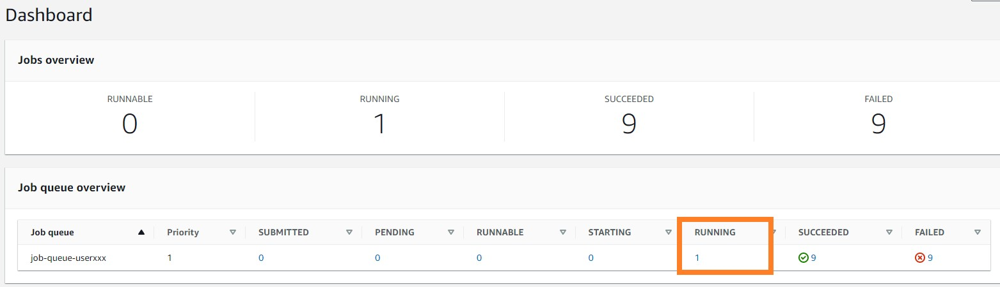
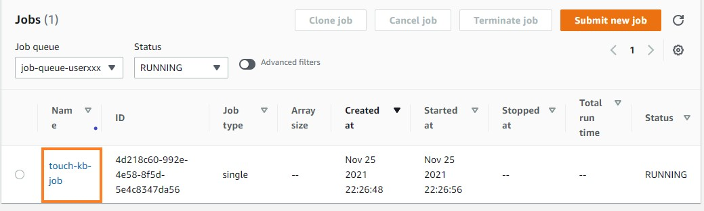
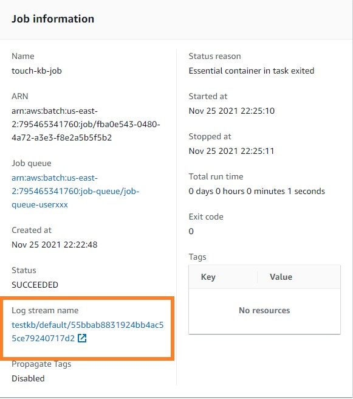
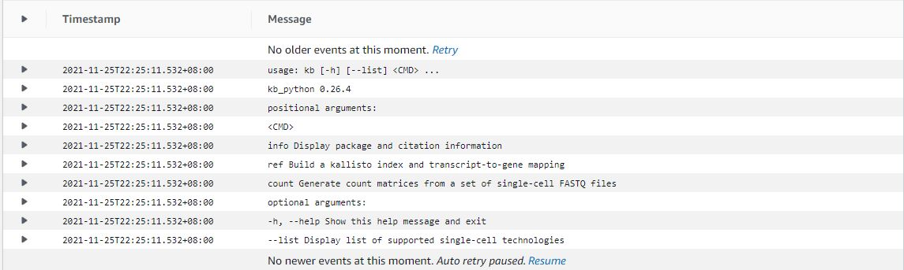
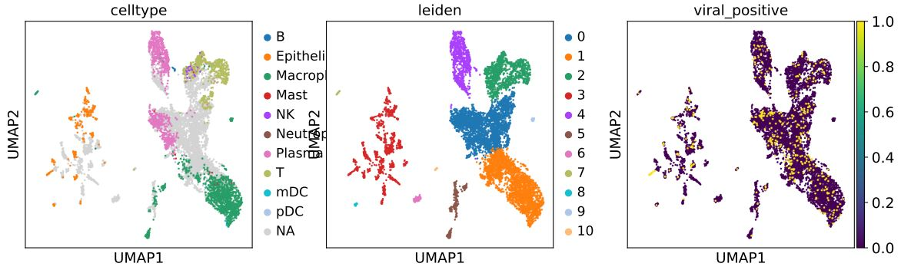

# Nextflow on Batch
{: .no_toc }

## Table of contents
{: .no_toc .text-delta }

1. TOC
{:toc}

---

## Update Configuration 
Now that we have created queues and compute environments, we can wire them into Nextflow.

Nextflow will evaluate a nextflow.config file next to the script we are executing (which would be the file in the current directory) and also fall back to $HOME/.nextflow/config for additional configuration. As we are going to use the latter one when using AWS Batch Squared we are changing both.

Firstly, the user-specific Nextflow configuration file.


```shell
cd ~/environment/aws-workshop/
cat > $HOME/.nextflow/config  << EOF
profiles {
  standard {
    process.container = 'public.ecr.aws/b6a4h2a6/kb_workshop:latest'
    docker.enabled = true
  }

  batch {
    aws.region = '${AWS_REGION}'
    process.container = 'public.ecr.aws/b6a4h2a6/kb_workshop:latest'
    process.executor = 'awsbatch'
    process.queue = [***Fill your own job queue name here***]
  }
}
EOF
```

**Remember to set the process.queue to the name of your own job queue.**

Nextflow will evaluate a nextflow.config file next to the script we are executing (which would be the file in the current directory) and also fall back to $HOME/.nextflow/config for additional configuration. As we are going to use the latter one when using AWS Batch squared we are changing both. Thus, we are going to change the Nextflow configuration files.

## Create result S3 Bucket

Remember that you have an S3 bucket that keeps the results in ${BUCKET_NAME_RESULTS}.

```shell
echo ${BUCKET_NAME_RESULTS}
nextflow-spot-batch-result-20033-1587976463
```

Here we would like to deploy another bucket to store the temporary files that AWS batch need to run in AWS Batch

```shell
export BUCKET_NAME_TEMP=nextflow-spot-batch-temp-${RANDOM}-$(date +%s)
aws --region ${AWS_REGION} s3 mb s3://${BUCKET_NAME_TEMP}
aws s3api put-bucket-tagging --bucket ${BUCKET_NAME_TEMP} --tagging="TagSet=[{Key=nextflow-workshop,Value=true}]"
echo "BUCKET_NAME_TEMP=${BUCKET_NAME_TEMP}" |tee -a ~/.bashrc 
echo ${BUCKET_NAME_TEMP}
```
"nextflow-spot-batch-result-14962-1637501981". **Remember the AWS bucket location** again.


## Nextflow

After all settings are done. We can simply execute our nextflow script as follows:

```shell
nextflow run script1.nf -profile batch -bucket-dir s3://${BUCKET_NAME_TEMP} --outdir=s3://${BUCKET_NAME_RESULTS}/batch
```
This step may take around 16 minutes. The output is going to look like to this:

```shell
N E X T F L O W  ~  version 21.10.0
Launching `script1.nf` [pedantic_banach] - revision: 5a7b285dbf
SCVH - N F   P I P E L I N E
===================================
transcriptome: s3://awsscwsbucket/ref/
reads        : s3://awsscwsbucket/seqs/SRR11537951/*_{2,1}.fastq.gz
outdir       : s3://nextflow-spot-batch-result-14962-1637501981/batch

executor >  awsbatch (1)
[8d/08a183] process > Map (1) [100%] 1 of 1 ✔
Waiting files transfer to complete (1 files)
Completed at: 25-Nov-2021 14:42:58
Duration    : 16m 14s
CPU hours   : 3.1
Succeeded   : 1
```

## Monitoring Job

Heading back to the [dashboard](https://console.aws.amazon.com/batch/home#dashboard), you can see the overview of the number of tasks running in the job queue. To monitor your running jobs, you can click the number below the label "RUNNING".



Here, you can find the job submited previously. Click the job name to go to the Jb information page.



Inside the information page, you can click the link below the "Log stream name" label. This is where the output of the program stored. It will record any information output within the stand output stream of the console. Also, the console output will refresh continuously along with your program process.



Inside the log stream, we can see the help information of the KB tool as we expect.




## View results
You can select go the [S3 bucket link here](https://s3.console.aws.amazon.com/s3/home). Looking into the path: "s3://${BUCKET_NAME_RESULTS}/batch/alignment_results/figures/umapumapplot.pdf" page. Click to open it. The result UMAP plot should be similar to this: 




## View pricing of the program

To check the bill of our previous run, we can go to the EC2 Dashboard and find the Spot Request section at [https://console.aws.amazon.com/ec2sp/v2/home#/spot](https://console.aws.amazon.com/ec2sp/v2/home#/spot). Click saving summary to view the cost we saved by applying spot instances.


This saving summary page shows the price. We know that to align a 12GB scRNA-Seq sample takes $0.17. Thanks to the spot instances, we can save 79% of money compared to hosting an on-demand EC2 instance.


<div class="code-example" markdown="1">
[Previous Step](https://juychen.github.io/docs/4_Batch/BatchQueue.html){: .btn }
[Next Step](http://example.com/){: .btn .btn-purple }
</div>