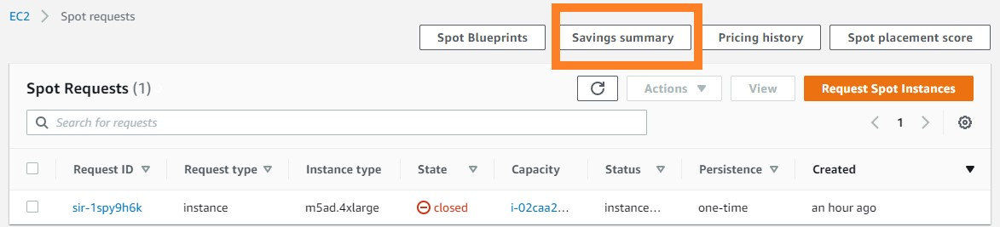

# Nextflow on Batch

## Update Configuration 
Now that we have created queues and compute environments, we can wire them into Nextflow.

Nextflow will evaluate a nextflow.config file next to the script we are executing (which would be the file in the current directory) and also fall back to $HOME/.nextflow/config for additional configuration. As we are going to use the latter one when using AWS Batch Squared we are changing both.

Firstly, the user-specific Nextflow configuration file.


```shell
cd ~/environment/aws-workshop/
cat > $HOME/.nextflow/config  << EOF
profiles {
  standard {
    process.container = 'public.ecr.aws/b6a4h2a6/kb_workshop:latest'
    docker.enabled = true
  }

  batch {
    aws.region = '${AWS_REGION}'
    process.container = 'public.ecr.aws/b6a4h2a6/kb_workshop:latest'
    process.executor = 'awsbatch'
    process.queue = 'job-queue-userxxx'
  }
}
EOF
```

Remember to rename 'job-queue-userxxx' to the name of your own job queue.

Nextflow will evaluate a nextflow.config file next to the script we are executing (which would be the file in the current directory) and also fall back to $HOME/.nextflow/config for additional configuration. As we are going to use the latter one when using AWS Batch squared we are changing both. Thus, we are going to change the Nextflow configuration files.

## Create result S3 Bucket

Remember that have a S3 bucket that keeps the results in ${BUCKET_NAME_RESULTS}.

```shell
echo ${BUCKET_NAME_RESULTS}
nextflow-spot-batch-result-20033-1587976463
```

Here we would like to depoly another bucket to store the temporary files that AWS batch need to run in AWS Batch

```shell
export BUCKET_NAME_TEMP=nextflow-spot-batch-temp-${RANDOM}-$(date +%s)
aws --region ${AWS_REGION} s3 mb s3://${BUCKET_NAME_TEMP}
aws s3api put-bucket-tagging --bucket ${BUCKET_NAME_TEMP} --tagging="TagSet=[{Key=nextflow-workshop,Value=true}]"
echo ${BUCKET_NAME_TEMP}
```
"nextflow-spot-batch-result-14962-1637501981". **Remember the AWS bucket location** again.


## Nextflow

After all settings are done. We can simply execute our nextflow script as follows:

```shell
nextflow run script1.nf -profile batch -bucket-dir s3://${BUCKET_NAME_TEMP} --outdir=s3://${BUCKET_NAME_RESULTS}/batch
```
This step may take around 16 minutes. The output is going to look like to this:

```shell
N E X T F L O W  ~  version 21.10.0
Launching `script1.nf` [pedantic_banach] - revision: 5a7b285dbf
SCVH - N F   P I P E L I N E
===================================
transcriptome: s3://awsscwsbucket/ref/
reads        : s3://awsscwsbucket/seqs/SRR11537951/*_{2,1}.fastq.gz
outdir       : s3://nextflow-spot-batch-result-14962-1637501981/batch

executor >  awsbatch (1)
[8d/08a183] process > Map (1) [100%] 1 of 1 ✔
Waiting files transfer to complete (1 files)
Completed at: 25-Nov-2021 14:42:58
Duration    : 16m 14s
CPU hours   : 3.1
Succeeded   : 1
```

## Monitoring Jobs

The monitoring of job is similar to the content we introduced in the previous section of [minitoring-job](https://juychen.github.io/docs/4_Batch/BatchJob.html#minitoring-job).

## View pricing of the program

To check the bill of our previous run, we can go to the EC2 Dashboard and find the Spot Request section at [https://console.aws.amazon.com/ec2sp/v2/home#/spot](https://console.aws.amazon.com/ec2sp/v2/home#/spot). Click saving summary to view the cost we saved by applying spot instances.



This saving summary page shows the price. We know that to align a 12GB scRNA-Seq sample takes $0.17. Thanks to the spot instances, we can save 79% of money compare to host a on-demand EC2 instance.


<div class="code-example" markdown="1">
[Previous Step](https://juychen.github.io/docs/Setup/Cloud9IAM.html){: .btn }
[Next Step](http://example.com/){: .btn .btn-purple }
</div>