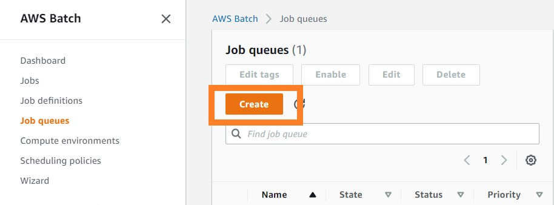
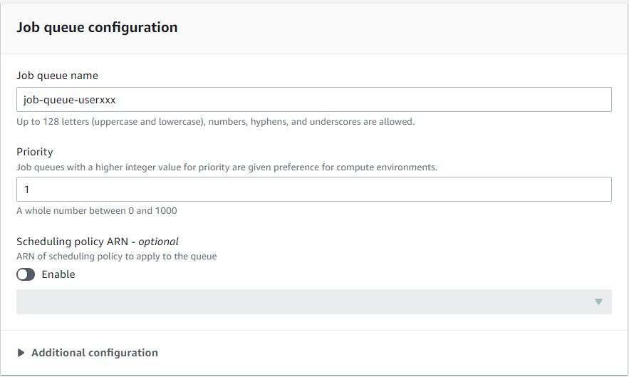
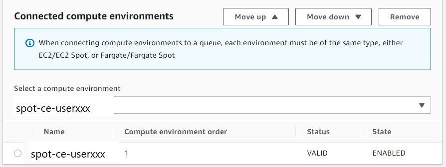

# Create Batch Job Queue
{: .no_toc }

## Table of contents
{: .no_toc .text-delta }

1. TOC
{:toc}

---

## Setup Batch Compute Envirionment

We can return back to the home page of Batch at: [https://us-east-2.console.aws.amazon.com/batch/home](https://us-east-2.console.aws.amazon.com/batch/home).

- Select "Job queues" on the left panel
- Select "Create" to creat a new job queue

- Name you job queue to "job-queue-userxxx" accodring to your user name.

- Select you compute environment to "spot-ce-userxxx" which you created in the previous step

- Select "Create" to creat a new job queue

[Previous Step]https://juychen.github.io/docs/4_Batch/BatchEnvironment.html){: .btn }
[Next Step](https://juychen.github.io/docs/4_Batch/BatchJob.html){: .btn .btn-purple }

