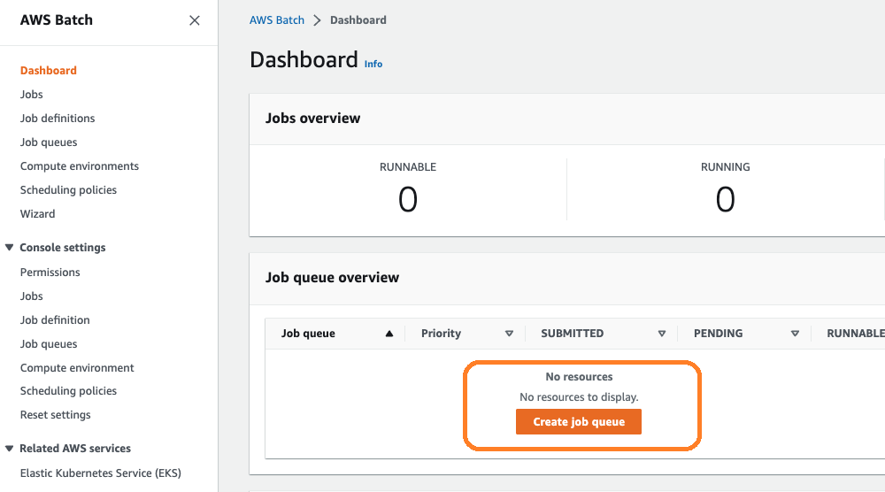

# Create Batch Job Queue
{: .no_toc }

## Table of contents
{: .no_toc .text-delta }

1. TOC
{:toc}

---

## Setup Batch Vulture Job Queue 1

We can return back to the home page of Batch at: [https://us-east-2.console.aws.amazon.com/batch/home](https://us-east-2.console.aws.amazon.com/batch/home).

1) Select "Job queues" on the left panel
2) Select "Create" to create a new job queue

3) Name your job queue to according to your preference.

4) Select your compute environment to which you created in the previous chapter i.e. [Batch Environment](https://juychen.github.io/docs/4_Batch/BatchEnvironment.html)

5) Select "Create" to create a new job queue

## Setup Batch Vulture Job Queue 2

We can return back to the home page of [Batch](https://us-east-2.console.aws.amazon.com/batch/home). Create a Job Queue 2 for parallel processing of Vulture tasks by repeating the same steps from Step 1 to Step 4 used to create Job Queue 1 above.

[Previous Step](https://juychen.github.io/docs/4_Batch/BatchEnvironment.html){: .btn }
[Next Step](https://juychen.github.io/docs/4_Batch/BatchJobMonitoring.html){: .btn .btn-purple }

