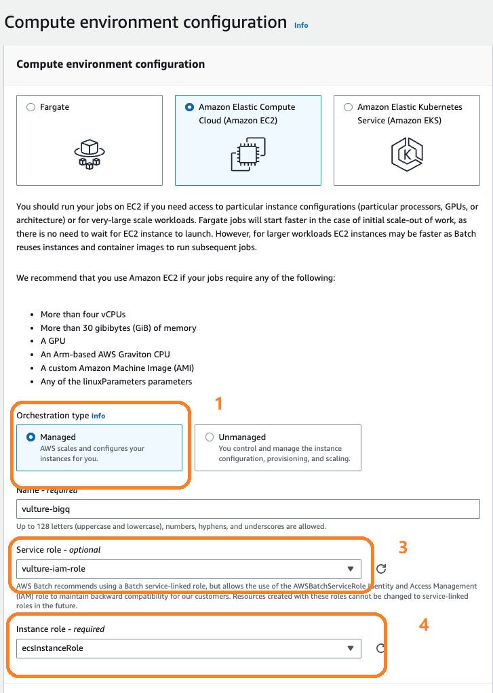
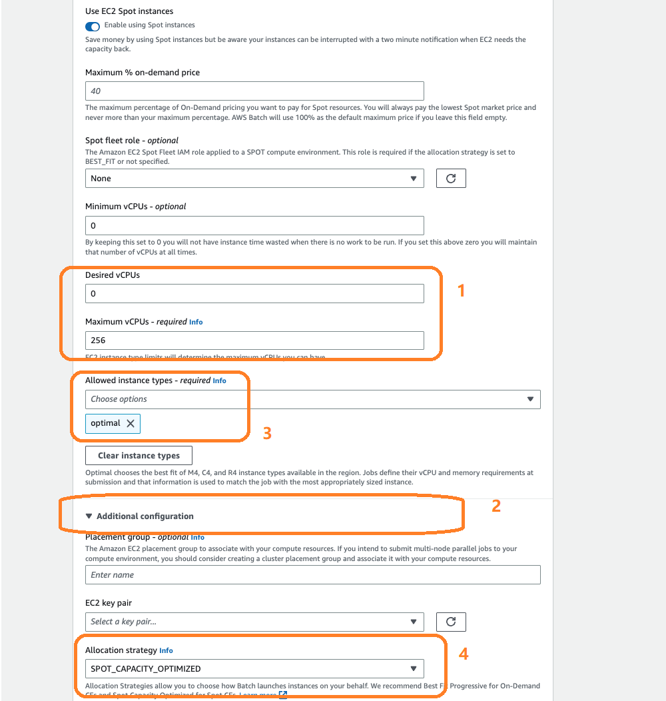
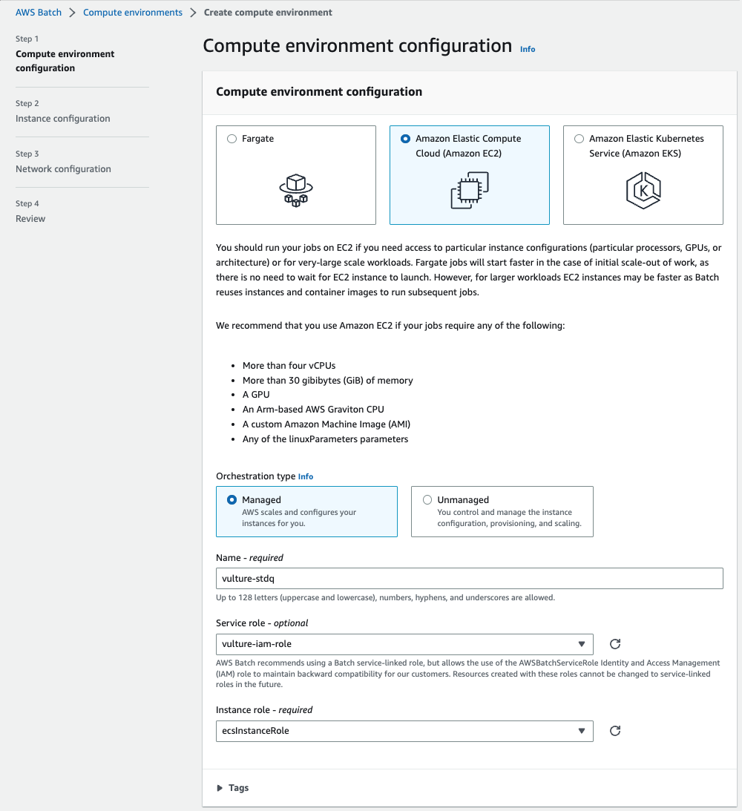
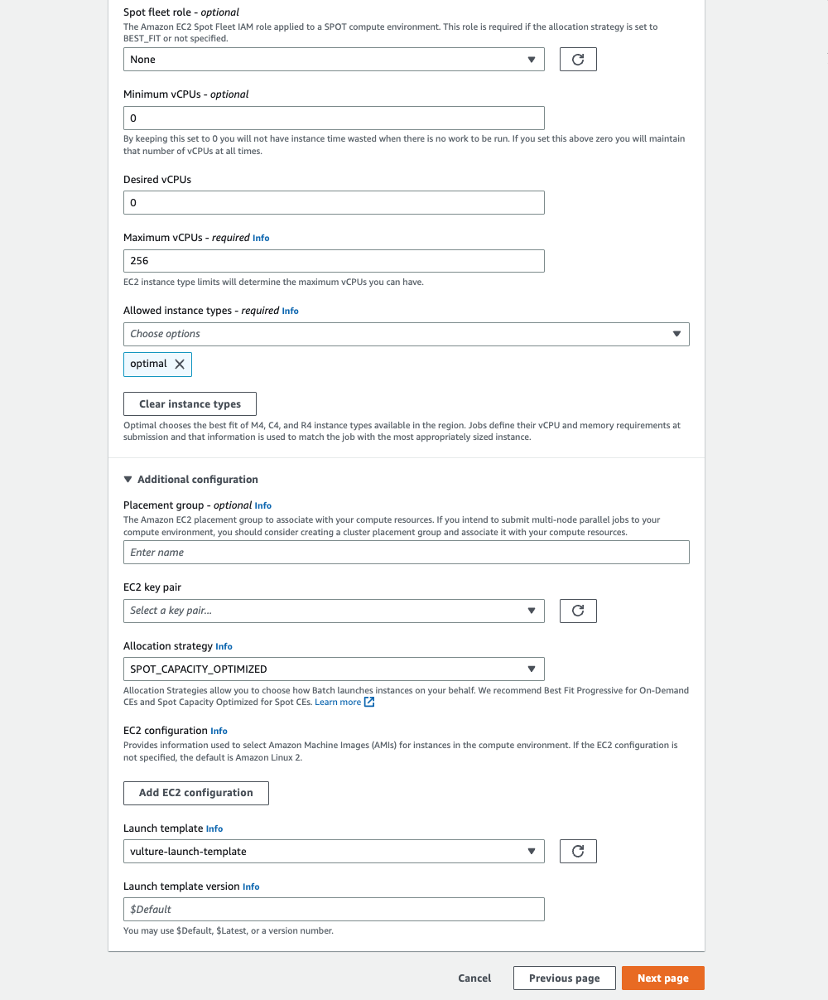
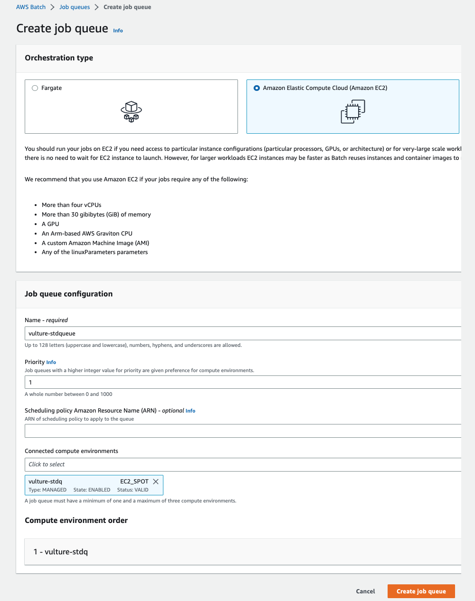

# Overview
{: .no_toc }

AWS Batch enables developers, scientists, and engineers to easily and efficiently run hundreds of thousands of batch computing jobs on AWS. AWS Batch dynamically provisions the optimal quantity and type of computational resources (e.g., CPU or memory optimized instances) based on the volume and specific resource requirements of the batch jobs submitted. With AWS Batch, there is no need to install and manage batch computing software or server clusters that you use to run your jobs, allowing you to focus on analyzing results and solving problems. AWS Batch plans, schedules, and executes your batch computing workloads across the full range of AWS compute services and features, such as AWS Fargate, Amazon EC2, and Spot Instances.

There is no additional charge for AWS Batch. You only pay for the AWS resources (e.g. EC2 instances) you create to store and run your batch jobs.

In our tutorial, the pipeline of Nextflow and Batch deal with jobs by the following workflow automatically：

1. We configure and run Nextflow script to trigger a submission to the job queue.
2. The AWS Batch scheduler runs periodically to check for jobs in the job queue
3. Once jobs are placed, the scheduler evaluates the Compute Environments and adjusts the compute capacity to allow the jobs to run.
4. The job (packaged by the container) will run in the computational environment created.
5. The job output will be transferred and stored in the S3 bucket.

## Create a launch template 
Before you create an AWS Batch Compute Environment, please kindly refer to [how to create Vulture launch template](https://juychen.github.io/docs/6_Cloud/RunVulture.html) to create a launch template first.

## Setup Batch Vulture Compute Environment 1

Create an AWS Batch Environment at [AWS Batch Home](https://console.aws.amazon.com/batch/home).

On the AWS Batch dashboard:
1) Select "Compute environments" on the left panel
2) Select "Create" to create a new compute environments

In the Compute Environments page, set your preference of the compute environment as follows:
Step 1 Compute environment configuration
3) Select "Managed" in the compute environment orchestration type
4) Change the Name in the compute environment name. We suggest that you should use "scvh-CE-r5a4x".
5) Select "vulture-iam-role" in the Service role ([IAM role settings](https://juychen.github.io/docs/2_Setup/SetupIAM.html)). 
6) Select "ecsInstanceRole" in the Instance role. 

Step 2 Instance configuration
7) Select "Use EC2 Spot Instances" for cost-saving

8) Set "0" in both Minium and Desired vCPU settings, and 256 in Maximum CPUs -required
9) Scoll down to the "Additional configuration".

10) Select "optimal" in the Allowed instance type.
11) Select "SPOT_CAPACITY_OPTIMIZED" in the allocation strategy

12) Select "vulture-launch-template" under Launch template. For how to create this template beforehand. Please refer to [launch template](https://juychen.github.io/docs/10_Supplementary/Launchtemp.html). 

We apply this template to every instance Batch schedules for us because we have mentioned in the previous section that the default  storage of EC2 instance is not enough for the Vulture pipeline, this template will provide extra spaces for our Batch job's instance. 

Step 3 Network configuration
13) Select "Default for VPC" under the Virtual Private Cloud (VPC) ID, this will select the [default VPCs](https://docs.aws.amazon.com/vpc/latest/userguide/default-vpc.html). Note that all AWS accounts comes with a default VPC for use in each Region. A default VPC comes with a public subnet in each Availability Zone, an internet gateway, and settings to enable DNS resolution. Therefore, you can immediately start launching Amazon EC2 instances into a default VPC. A default VPC is suitable for getting started quickly.

Leave other settings of the environment as default and create an environment.

## Setup Batch Vulture Compute Environment 2 

This basically follows the same steps as to create Compute Environment 1 above, but with different name and instance type, to enable massively parallel processing of Vulture tasks with Batch.

1) Select "Compute environments" on the left panel
2) Select "Create" to create a new compute environments

Repeat the configuration steps from Step 2. to Step 13 to finish create Compute Environment 2 used for creating Compute Environment 1 above.

## Monitoring Job

Heading back to the [Batch Home dashboard](https://console.aws.amazon.com/batch/home#dashboard), you can see the overview of the number of tasks running in the job queue. To monitor your running jobs, you can click the number below the label "RUNNING".

Here, you can find the job submited previously. Click the job name to go to the job information page.

Inside the information page, you can click the link below the "Log stream name" label. This is where the output of the program stored. It will record any information output within the stand output stream of the console. Also, the console output will refresh continuously along with your program process.

## View results
You can select go the [S3 Bucket](https://s3.console.aws.amazon.com/s3/home). Looking into the path: "s3://${BUCKET_NAME_RESULTS}/batchD/{SAMPLE_ID}/alignment_outs/" page. Click to open it. The Vulture results should look like in the picture below: 

## View pricing of the program

To check the bill of our previous run, we can go to the EC2 Dashboard and find the Spot Request section at [https://console.aws.amazon.com/ec2sp/v2/home#/spot](https://console.aws.amazon.com/ec2sp/v2/home#/spot). Click saving summary to view the cost we saved by applying spot instances.

This saving summary page shows the price. We know that to align a 12GB scRNA-Seq sample takes $0.17. Thanks to the spot instances, we can save 79% of money compared to hosting an on-demand EC2 instance.

## Setup Batch Vulture Job Queue 1

We can return back to the home page of Batch at: [https://us-east-2.console.aws.amazon.com/batch/home](https://us-east-2.console.aws.amazon.com/batch/home).

1) Select "Job queues" on the left panel
2) Select "Create" to create a new job queue

3) Name your job queue to according to your preference.

4) Select your compute environment to which you created in the previous chapter i.e. [Batch Environment](https://juychen.github.io/docs/4_Batch/BatchEnvironment.html)

5) Select "Create" to create a new job queue

## Setup Batch Vulture Job Queue 2

We can return back to the home page of [Batch](https://us-east-2.console.aws.amazon.com/batch/home). Create a Job Queue 2 for parallel processing of Vulture tasks by repeating the same steps from Step 1 to Step 4 used to create Job Queue 1 above.

[Previous Step](https://juychen.github.io/docs/5_Cloud/Nextflow.html){: .btn }
[Next Step](https://juychen.github.io/docs/6_Local/Localrun.html){: .btn .btn-purple }

