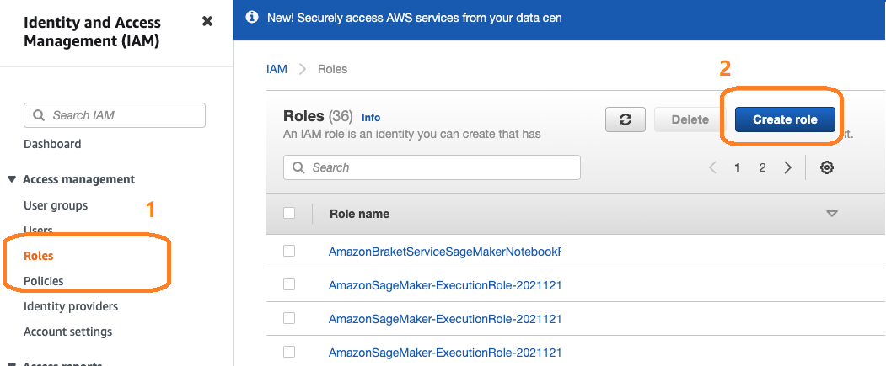
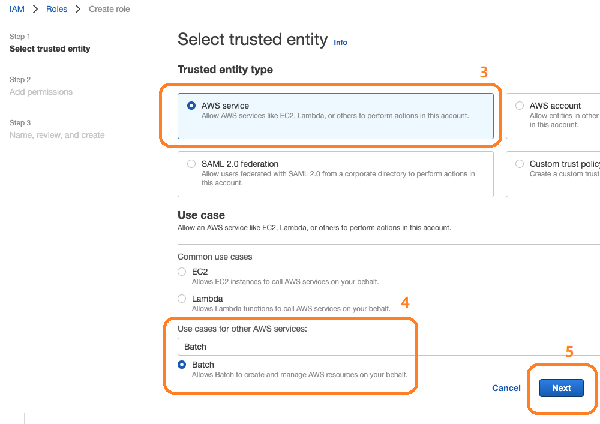
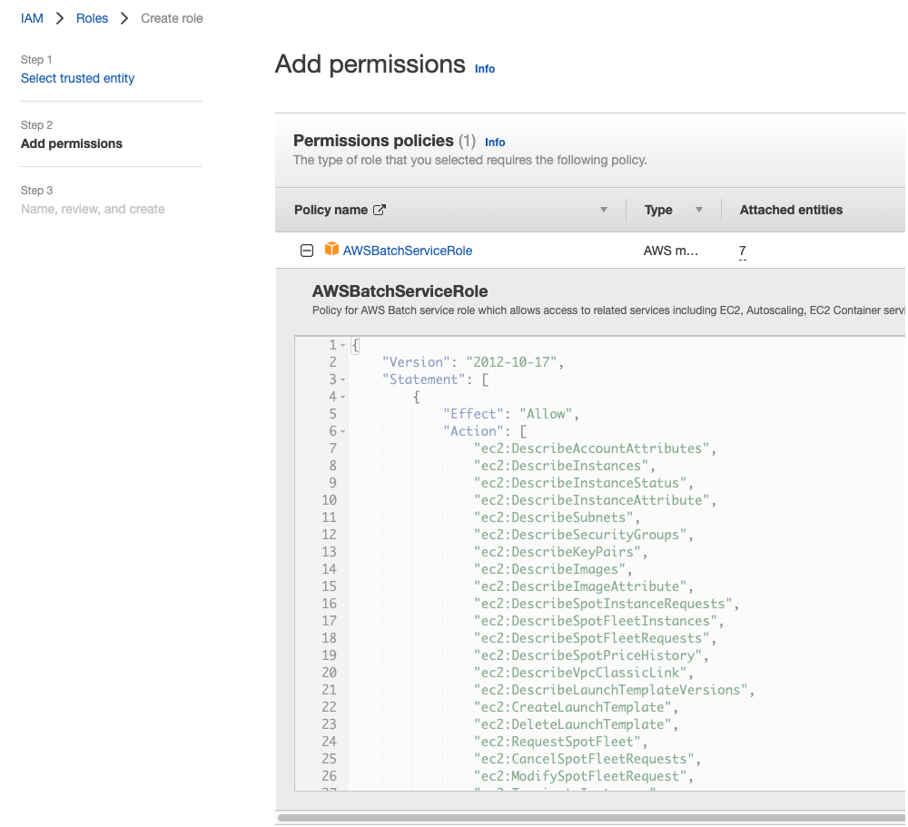
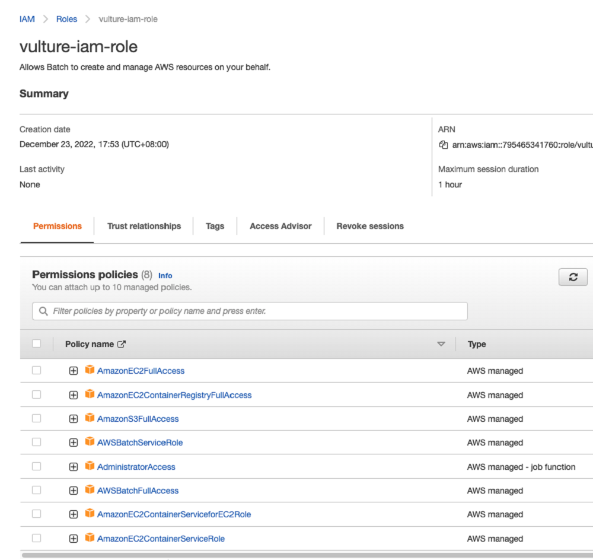
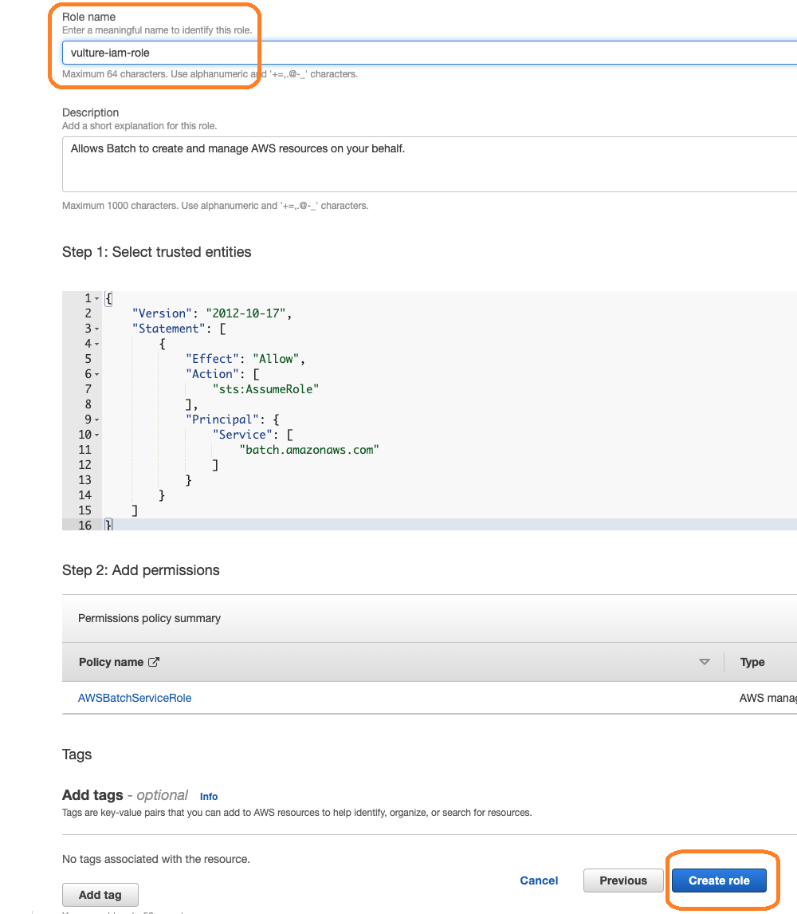

To get started with Vulture, you will need a AWS account and setup the environment in your account. Vulture is composed of a stack of AWS services as below:

# Setup
{: .no_toc }
This chapter guides you to configure the following AWS services which you will use in Vulture. 
- AWS IAM
- AWS Batch
- AWS S3

## Create an IAM role for your Workspace

1. Head over to the [IAM console](https://console.aws.amazon.com/iam/home), find and click "Create role" button **(2)** under the Roles **(1)** section.

2. Select the "AWS service" **(3)** and choose the "Batch" use case **(4)** hit Next button **(5)** at the bottom.

3. Select the following policies and click "attach policies" to add them **(6)**.

- AdministratorAccess
- AmazonEC2FullAccess
- AmazonEC2ContainerRegistryFullAccess
- AmazonS3FullAccess
- AWSBatchServiceRole
- AdministratorAccess
- AWSBatchFullAccess
- AmazonEC2ContainerServiceforEC2Role
- AmazonEC2ContainerServiceRole

4. Name the role as "vulture-iam-role" and click "Create role".

Therefore, a role named "aws-workshop-admin" is ready for use.

[Previous Step](https://juychen.github.io/docs/5_Cloud/Nextflow.html){: .btn }
[Next Step](https://juychen.github.io/docs/5_Cloud/RunVulture.html){: .btn .btn-purple }

