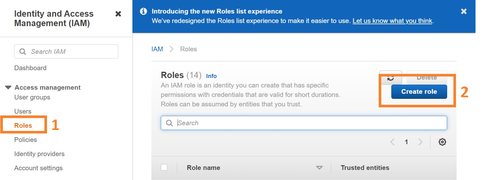

## Create an IAM role for your Workspace

Head over to the [IAM console](https://console.aws.amazon.com/iam/home), find and click "Create role" button **(2)** under the Roles **(1)** section.

Select the "AWS service" **(3)** and choose the "EC2" use case **(4)** hit Next button **(5)** at the bottom.

Select the policy named "AdministratorAccess" **(6)**.

Tag the role with a key named "aws-workshop" with an empty value, name the role as "aws-workshop-admin" and click "Create role".

Therefore, a role named "aws-workshop-admin" is ready for the Cloud9 envrioment.