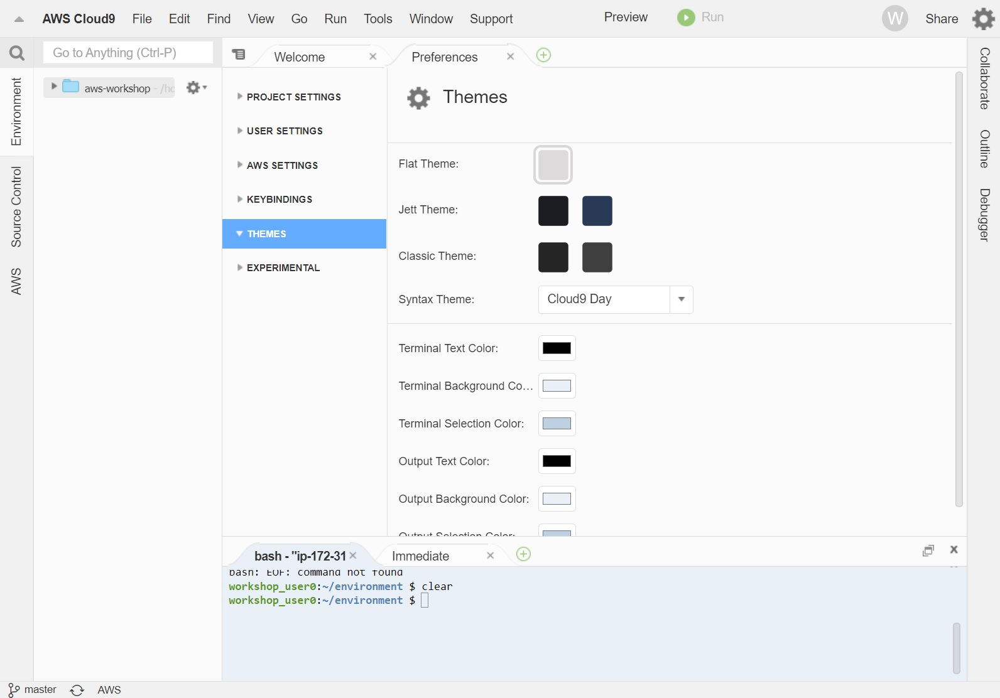
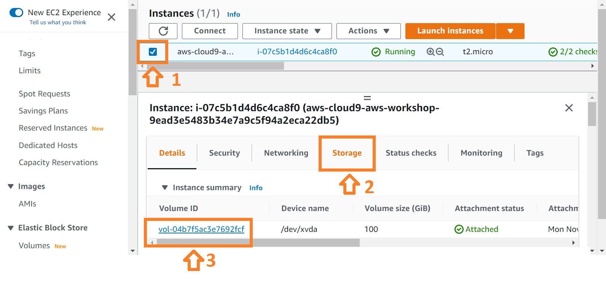
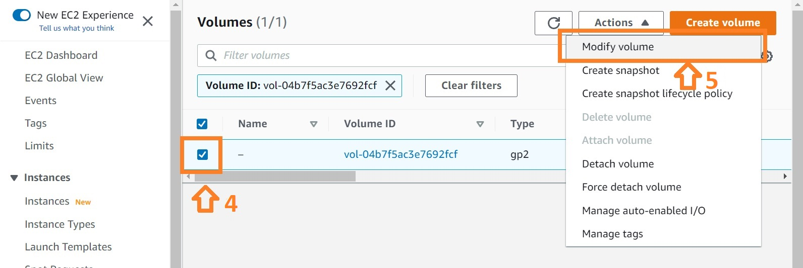
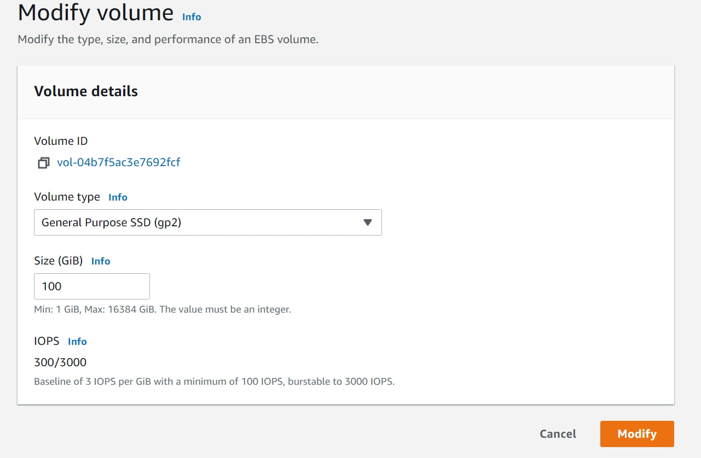
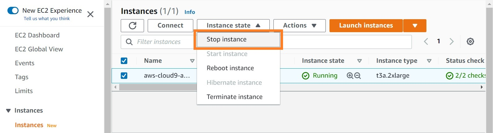
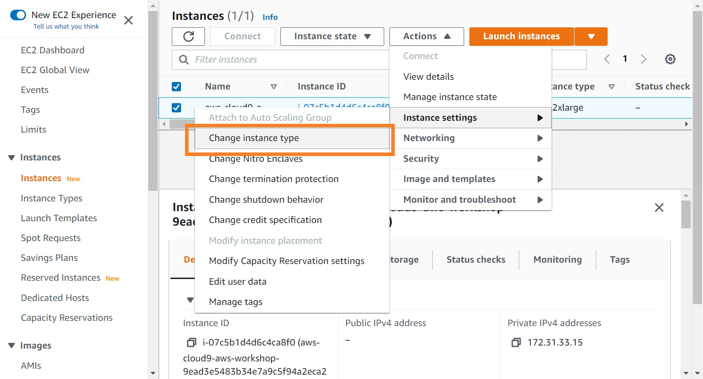
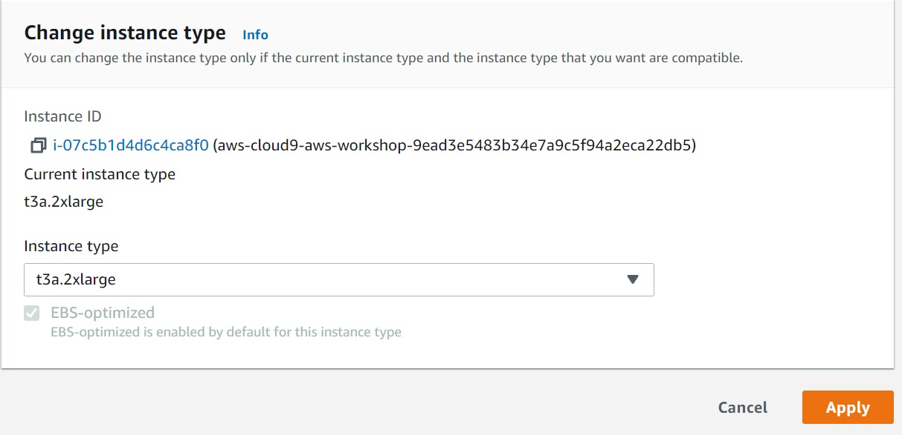

# Create AWS Batch Environmnet
{: .no_toc }

## Table of contents
{: .no_toc .text-delta }

1. TOC
{:toc}

---

## Setup Batch

Create an AWS Batch Environment at: [https://us-east-2.console.aws.amazon.com/batch/home](https://us-east-2.console.aws.amazon.com/batch/home).

- Select "Create"
- Name it "aws-workshop", and take all other defaults

Your workspace should now look like this:

## Increase the storgate of the Cloud9 EBS

The default 10GB storage, 1 CPU, and 1GB memory of Cloud9 workspace is quite small. Thus, it is good for us to increase the computational resources used by the Cloud9 instance for the tutorial.

Firstly, we increase the storage of the instance. To increase the EBS volume, please perfrom as follows:
1. Select the Cloud9 instance in the [EC2 console](https://console.aws.amazon.com/ec2/v2/home#Instances).
2. Click the "Storage" chart
3. Roll down, explore, and click on the "Volume ID" in the list
4. Select the Volume in the list
5. Click "Modify volume" in the sub-menu of the "Actions" button
6. Modify the volume type and size on your own demand (e.g. 100GiB) and click modify.

Consequentlly, the storge of our Cloud9 work spaces is 100GB now.

## Increase the number of CPU and Memory for the Cloud9 

In this step, we will increase the amount of CPU and memory storage in Cloud9. To performe this modification, we need to stop the instances by selecting: "Instance state -> Stop Instance". It may take serveral second for the system to stop the instance.

Afterwards, we will change the instance type of the Cloud9 workspace. To performe this modification, select: "Actions -> Change instances type". In the pop-up menu, we can select the instance type of "t3a.2xlarge". This instance type will have 32GB of memory and 8 CPUs to meet the minimun requirement of runing the workshop.

Finially, we need to restart the Cloud9 Environment at: [https://console.aws.amazon.com/cloud9/home](https://console.aws.amazon.com/cloud9/home).

[Previous Step](https://juychen.github.io/docs/Setup){: .btn }
[Next Step](https://juychen.github.io/docs/Setup/Cloud9IAM.html){: .btn .btn-purple }

