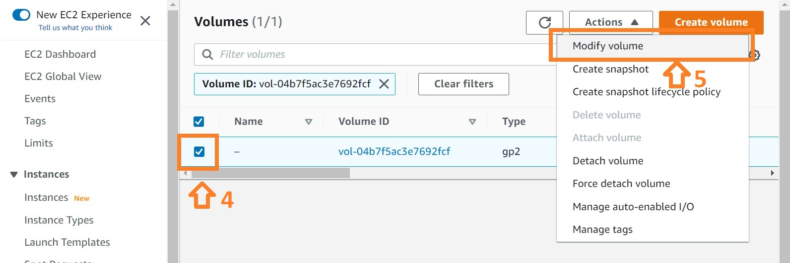

# Cloud9
{: .no_toc }

## Table of contents
{: .no_toc .text-delta }

1. TOC
{:toc}

---

## Launch Cloud9

Create a Cloud9 Environment at: [https://console.aws.amazon.com/cloud9/home](https://console.aws.amazon.com/cloud9/home).

- Select Create environment
- Name it "aws-workshop", and take all other defaults

Your workspace should now look like this:

## Increase the storage of the Cloud9 EBS

The default 10GB storage of Cloud9 workspace is quite small. Thus, it is good for us to enlarge the EBS volume used by the Cloud9 instance.

To increase the EBS volume, please perfrom as follows:
1. Select the Cloud9 instance in the [EC2 console](https://console.aws.amazon.com/ec2/v2/home#Instances).
2. Click the "Storage" chart
3. Roll down, explore, and click on the "Volume ID" in the list

4. Select the Volume in the list
5. Click "Modify volume" in the sub-menu of the "Actions" button

6. Modify the volume type and size on your own demand (e.g. 100GiB) and click modify.

[Previous Step](https://juychen.github.io/docs/Setup){: .btn }
[Next Step](https://juychen.github.io/docs/Setup/Cloud9IAM.html){: .btn .btn-purple }

