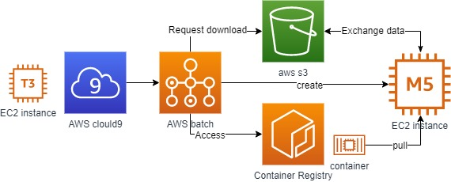

## Welcome to the AWS workshop

The content of this workshop is derived from a tutorial [Nextflow with Batch](https://genomics-nf.workshop.aws/). But we change the goal to run our viral calling pipeline, which we will run locally in containers, submit locally to AWS Batch and run a batch job that submits to AWS Batch.

## Overview
During this workshop, you will implement a proof of concept of AWS. The goal of this workshop is to get familiar with the concepts of Nextflow and AWS Batch.
Then runing a pipeline with simple scRNA-Seq as follows:

- EC2: cloud server instances
- EC2 Spot: benefit from unused EC2 capacity
- Cloud9: cloud coding IDE
- Batch: batch computing of containers

## Other concepts
- Docker: container services
- Nextflow: language reproduce scientific workflows

[Start](https://juychen.github.io/docs/1_Introduction/Introduction.html){: .btn .btn-purple }

